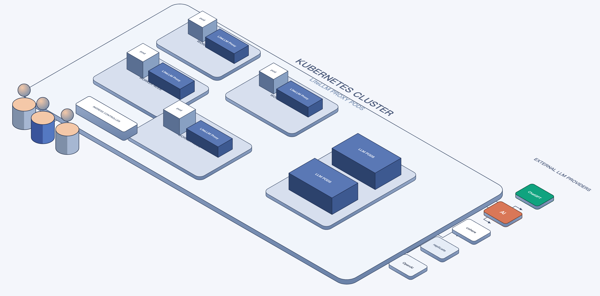
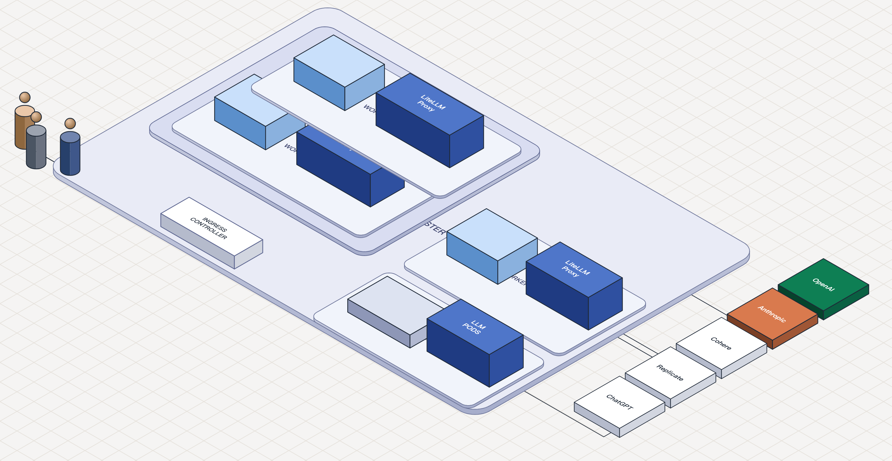
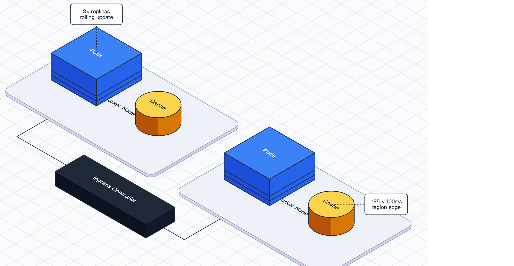

# iso-topology

**Text in. Isometric SVG out. Architecture diagrams your agent can generate, validate, and diff.**



[](LICENSE)
[](https://go.dev)
[](https://pkg.go.dev/github.com/MarkovWangRR/iso-topology)

A renderer that turns textual graph DSL into self-contained 2.5D
isometric SVG. The DSL is small enough for an LLM to generate from a
prompt, structured enough to validate before render, and diffable
enough to commit alongside your code.

Agent-first. Humans welcome.

## Quickstart

```bash
# install
go install github.com/MarkovWangRR/iso-topology/cmd/isotopo@v0.2.1

# render a 3-node topology
echo 'user -> api -> db' > scene.d2
isotopo render scene.d2 ./out

# inspect: SVG + editable DSL side-by-side
open ./out/topology.html
```

Single static binary. No CGO, no system fonts, no runtime deps. Drop
it into a CI image or an agent container and it works.

## The agent loop

```bash
isotopo capabilities          # discover shapes / primitives / layouts (read once)
isotopo validate scene.d2     # JSONPath-located issues with "did you mean"
isotopo render   scene.d2 out # produce SVG + per-element fragments
```

The agent reads `capabilities` at startup to learn what DSL it can
emit, generates a scene, asks `validate` for structural errors and
applies the suggestions, then calls `render`. No human in the loop.

Sample `validate` output for an agent-generated draft with a typo:

```json
{
  "issues": [
    {
      "severity": "error",
      "path": "nodes.scene.parts[0].shape",
      "message": "unknown shape \"cilinder\"",
      "suggest": "cylinder"
    }
  ]
}
```

Exit codes: `0` clean, `2` warnings only, `3` errors. Wire it straight
into a CI loop.

## Why isometric

Flat 2D topology (d2, Mermaid, Graphviz) reads as a list of boxes.
Iso reads as a **system**: the depth axis separates edge / mid-tier
/ data tiers at a glance, and stacked nodes naturally express
replicas and HA.

Hand-authored iso (Figma, FossFlow) scales to about ten elements and
zero people on the diff. iso-topology takes the DSL path: text in,
iso SVG out, source-controlled, agent-generatable.

## Gallery

### Microservice (.d2 → dagre auto-layout)


```d2
user:   User { shape: person }
api:    API Gateway
queue:  Job Queue { shape: queue }
worker: Worker
db:     Database { shape: cylinder }
cache:  Cache    { shape: cylinder }

user   -> api:   request
api    -> queue: enqueue
api    -> cache: lookup
queue  -> worker
worker -> db:    write
worker -> cache: update
```

Source: [testdata/microservice/input.d2](testdata/microservice/input.d2).

### Kubernetes cluster + LiteLLM proxies (nested groups)



Three-level nested `group` primitive: cluster wraps worker nodes,
each worker node wraps a proxy + a cache. Authored as YAML for
precise placement. Source:
[testdata/k8s-litellm/input.yaml](testdata/k8s-litellm/input.yaml).

### Four DSL primitives in one scene



`group` containers + `stack: {count: 3}` replicas + iso ground grid
+ screen-space `annotation` callouts — all four composition
primitives at once. Source:
[testdata/v2-showcase/input.yaml](testdata/v2-showcase/input.yaml).

## Two input modes

| Path | Strength | Use when |
|---|---|---|
| `.d2` graph source | auto-layout via dagre or ELK | agents generating topology from graph data, dynamic scenes |
| `.yaml` composite | precise iso world coordinates | designer-controlled scenes, fixed templates, infographics |

Both produce the same output structure. Same `Document` model under
the hood: `.d2` runs through `CompileD2 → Translate`, `.yaml` parses
directly. See [DSL_D2.md](docs/DSL_D2.md) and
[DSL_YAML.md](docs/DSL_YAML.md).

## Capabilities

- **23 d2 shapes** mapped to iso primitives (rectangle, cylinder,
  cloud, person, hexagon, queue, oval, …)
- **2 layout engines**: dagre (polyline edges), ELK (orthogonal,
  obstacle-avoidance)
- **4 composition primitives**: `group`, `stack`, `canvas.grid`,
  `annotation`
- **3 input formats**: `.d2`, `.yaml`, `.json`
- **Two-tier output**: topology SVG + per-element standalone SVG

Full machine-readable list:

```bash
isotopo capabilities | jq '.shapes[].iso_name, .primitives[].name'
```

## Output

```
out/
├── topology.svg              full scene
├── topology.html             SVG side-by-side with editable DSL source
├── topology.<yaml|d2|json>   source copy
└── nodes/
    ├── _index.html           gallery
    ├── <id>.svg              standalone iso element
    ├── <id>.html             embed snippet
    └── <id>.yaml             re-renderable DSL fragment
```

Drop `topology.svg` into any markdown / Notion / slide deck. Each
`nodes/<id>.svg` is a self-contained iso sticker. Embedding recipes
and troubleshooting: [OUTPUTS.md](docs/OUTPUTS.md).

## Use as a Go library

```go
import isotopo "github.com/MarkovWangRR/iso-topology"

doc, _ := isotopo.Parse(yamlBytes)
svg := isotopo.RenderWithCanvas(doc.Scene(), doc.Theme, doc.Canvas, doc.Annotations)
```

Full library API surface: [USAGE.md](docs/USAGE.md).

## Docs

| Doc | Read this when |
|---|---|
| [INSTALL.md](docs/INSTALL.md) | Setting up — `go install`, clone & build, library import |
| [USAGE.md](docs/USAGE.md) | CLI subcommands + Go library API reference |
| [DSL_YAML.md](docs/DSL_YAML.md) | YAML composite spec — precise iso placement |
| [DSL_D2.md](docs/DSL_D2.md) | `.d2` input spec — d2 shape mapping, nested containers |
| [DSL_THEME.md](docs/DSL_THEME.md) | Style / Theme cascade: Palette, Stroke, Text, Effects |
| [OUTPUTS.md](docs/OUTPUTS.md) | Output layout + embedding in docs / slides / LLM context |
| [EXTENDING.md](docs/EXTENDING.md) | Add a new shape, primitive, or layout engine |

## Status

Single-author project. API may evolve; pin to a tag if you depend on
it. The published `oss.terrastruct.com/d2` dependency is locked at
`v0.7.1`.

## Contributing

Issues and PRs welcome. Run `go test ./...` before sending —
`testdata/*/expected.svg` are golden files that catch unintended
output drift across the rendering pipeline.

## License

Apache License 2.0 — see [LICENSE](LICENSE).
