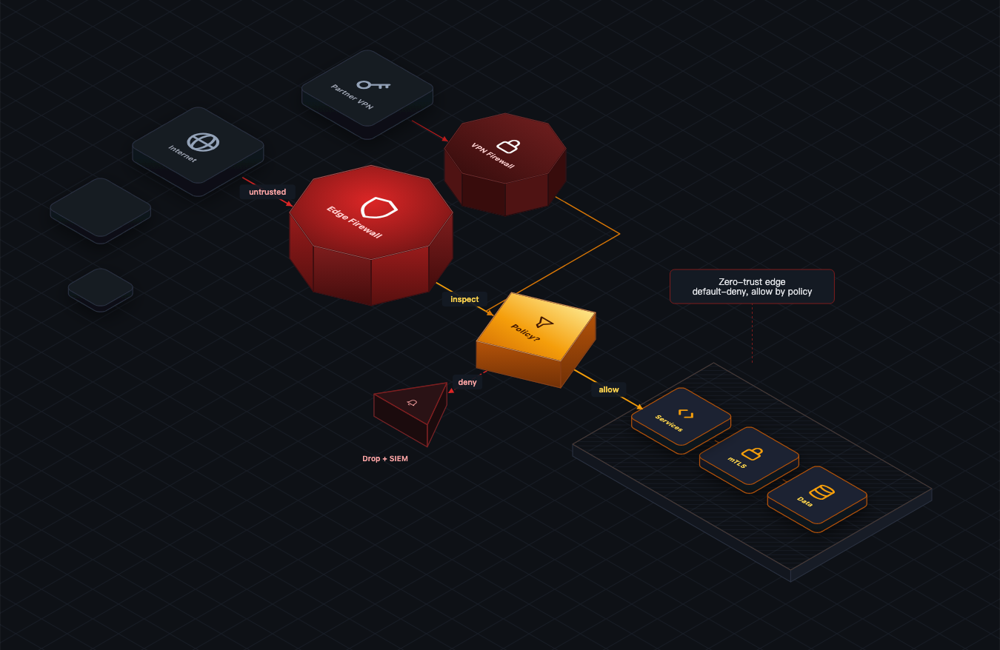
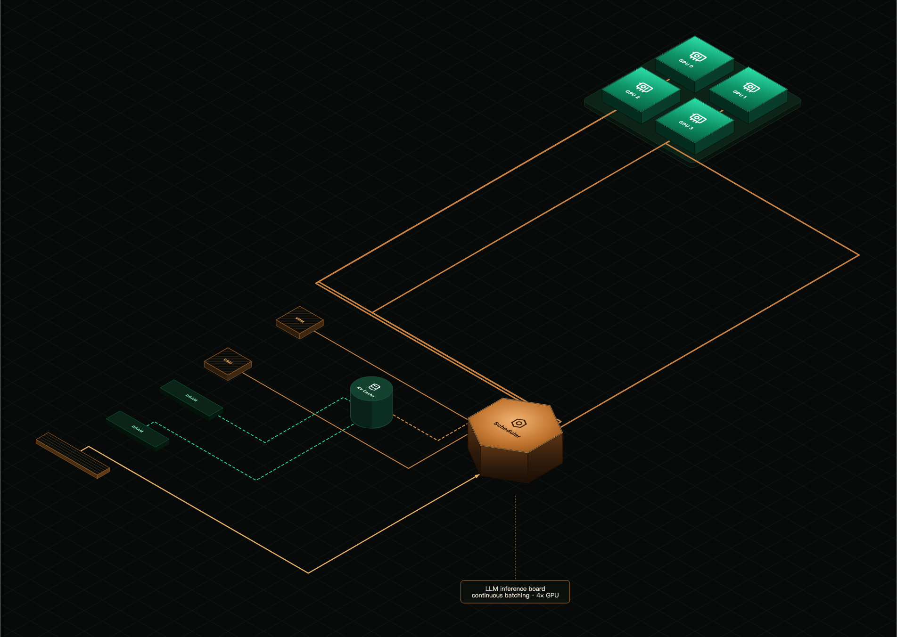
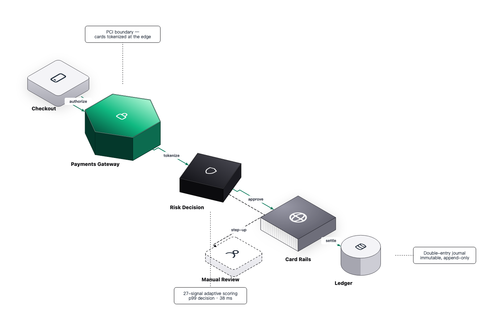

<div align="center">


# iso-topology — isometric architecture diagrams as code

[](LICENSE)
[](https://go.dev)
[](https://pkg.go.dev/github.com/MarkovWangRR/iso-topology)

**Text in. Isometric SVG out. Architecture diagrams your AI agent can generate, validate, and diff.**

Single static binary · zero runtime deps · renders in milliseconds · 200+ built-in icons (incl. real brand logos) · every sample golden-tested

English · [简体中文](README.zh-CN.md)

</div>

---

iso-topology is an open-source Go CLI and library that renders a small
text DSL into design-grade 2.5D **isometric SVG architecture
diagrams**. It is a diagram-as-code tool built agent-first: the DSL is
small enough for an LLM to emit from a prompt, machine-validatable
before render (with "did you mean" fix suggestions), and deterministic
enough to commit and diff alongside your code.

Agent-first. Humans welcome.

## From this…

```yaml
nodes:
  scene:
    shape: composite
    parts:
      - id: core                          # the hero anchors the scene
        shape: rectangle
        geom: { w: 170, d: 170, h: 24 }
        icon: "iso://glyph/sparkles/7C5CFC"
        label: "AI Core"
        style:
          effects: { cornerRadius: 14, backglow: { color: "#A78BFA", radius: 46 } }
      - id: llm
        place: { behind: core, gap: 2.6 } # ← relations, never coordinates
        icon: "iso://glyph/chat"
        label: "LLM Gateway"
      # …seven more satellites, each one `place` rule
```

## …to this


Every scene in this README is positioned entirely by `place` relations
and `layout` containers — not a single hand-computed coordinate.
Full source: [samples/topology/ai-platform/input.yaml](samples/topology/ai-platform/input.yaml).

## Start here — paste this into Claude

On a fresh machine, you shouldn't read install docs — your agent
should do the setup and then teach you the workflow. Paste this into
Claude Code (or any coding agent) and come back to a working
toolchain, a rendered sample, and instructions addressed to you:

````markdown
Set up the iso-topology diagram toolchain on this machine, then teach
me how to use it. Work autonomously; only stop if something needs my
password or a decision only I can make. Reply in the language I use.

## 1 · Install (idempotent — skip whatever is already present)
- Ensure Go ≥ 1.25 (`go version`); if missing, install it with the
  system package manager (macOS: `brew install go`; Debian/Ubuntu:
  `sudo apt install golang-go`; otherwise https://go.dev/dl).
- `go install github.com/MarkovWangRR/iso-topology/cmd/isotopo@latest`
- `go install github.com/MarkovWangRR/iso-topology/cmd/isotopo-mcp@latest`
- Ensure `$(go env GOPATH)/bin` is on PATH for this session.
- Install the drawing skill so future sessions already know the
  workflow:
  `mkdir -p ~/.claude/skills/draw-iso-diagram && curl -sL https://raw.githubusercontent.com/MarkovWangRR/iso-topology/main/skills/draw-iso-diagram/SKILL.md -o ~/.claude/skills/draw-iso-diagram/SKILL.md`

## 2 · Verify with a real render
- `isotopo capabilities | head -20` must print JSON.
- Render the showcase sample into ./diagrams/hello:
  `curl -sL https://raw.githubusercontent.com/MarkovWangRR/iso-topology/main/samples/topology/ai-platform/input.yaml -o /tmp/hello.yaml && isotopo render /tmp/hello.yaml ./diagrams/hello`
- Open ./diagrams/hello/topology.html and tell me what I should see.

## 3 · From now on, whenever I ask for a diagram
- Read `isotopo capabilities` once per session; imitate the closest
  fixture from
  https://raw.githubusercontent.com/MarkovWangRR/iso-topology/main/docs/agent/SAMPLES.md
  and follow the visual rules in
  https://raw.githubusercontent.com/MarkovWangRR/iso-topology/main/docs/guides/scene-design.md
- Author YAML with layout/place relations ONLY — never hand-computed
  coordinates; connectors are always routing: orthogonal.
- Loop `isotopo validate <file>` until exit 0, then render into
  ./diagrams/<kebab-case-name>/ and give me the topology.html path.
- Keep the YAML next to the output as input.yaml; when I ask for
  changes, edit it and re-render the same folder.

## 4 · Finish by telling me
- three example requests that show off what this tool does well, and
- how I should phrase change requests so you can apply them precisely.
````

After that you only do two things: **ask** ("draw my RAG pipeline,
dark mode, emerald accent, the vector DB is the hero") and **iterate**
("move the cache right of the gateway") — results always land in
`./diagrams/<name>/topology.html`. The full guide, including how to
phrase requests and debug results, is
[docs/getting-started/00-onboarding.md](docs/getting-started/00-onboarding.md).

## Quickstart (by hand)

```bash
# install (single static binary — works in CI images and agent containers)
go install github.com/MarkovWangRR/iso-topology/cmd/isotopo@latest

# render the hero scene above
curl -sLO https://raw.githubusercontent.com/MarkovWangRR/iso-topology/main/samples/topology/ai-platform/input.yaml
isotopo render input.yaml ./out
open ./out/topology.html        # interactive viewer (zoom/pan + hover-to-source)
isotopo serve input.yaml        # …or open the Studio: live edit + re-render
                                # → docs/guides/studio.md
```

Or start from a three-line graph and let auto-layout do everything:

```bash
echo 'user -> api -> db' > scene.d2
isotopo render scene.d2 ./out
```

## Make your agent draw

iso-topology speaks contract, not vibes. Your agent discovers the DSL,
emits a scene, gets machine-checkable feedback, and converges — no
human in the loop:

```bash
isotopo capabilities          # machine-readable DSL inventory (read once)
isotopo validate scene.yaml   # JSONPath-located issues + fix suggestions
isotopo render   scene.yaml out
```

`validate` output for a draft with a typo — apply `suggest`, re-run:

```json
{
  "issues": [
    {
      "severity": "error",
      "path": "nodes.scene.parts[0].shape",
      "message": "unknown shape \"cilinder\"",
      "suggest": "cylinder"
    }
  ]
}
```

Exit codes: `0` clean, `2` warnings only, `3` errors — wire it
straight into CI. Layout problems are caught too: dangling `place`
references, relation cycles, and post-solve overlaps (with the exact
colliding pair).

To plug it into Claude, Cursor, or any LLM in 30 seconds, give the
model this and point it at the repo:

```text
You can render iso architecture diagrams. Generate DSL using the
schema at docs/agent/schema/dsl.schema.json and the reference at
docs/agent/CAPABILITIES.md; imitate the fixture from
docs/agent/SAMPLES.md that best matches the task. Use
`isotopo validate <file>` to check before claiming done.
```

A full battle-tested system prompt (with positioning rules and output
contract) lives at [docs/agent/PROMPT_TEMPLATE.md](docs/agent/PROMPT_TEMPLATE.md)
— its capability section is generated from code, so it can't go stale.

Two deeper integrations ship in this repo:

- **MCP server** — `isotopo-mcp` exposes `iso_capabilities` /
  `iso_validate` / `iso_render` as MCP tools over stdio, so Claude
  Code, Claude Desktop, or Cursor can draw without shelling out:
  `claude mcp add isotopo -- isotopo-mcp`. Setup:
  [docs/agent/MCP.md](docs/agent/MCP.md).
- **Agent skill** — [`skills/draw-iso-diagram`](skills/draw-iso-diagram/SKILL.md)
  is an installable Claude Code skill encoding the whole workflow
  (discover → imitate a sample → author → validate loop → render)
  plus the visual-quality rules the gallery follows:
  `cp -r skills/draw-iso-diagram ~/.claude/skills/`.

There is also a repo-root [`llms.txt`](llms.txt) (generated, like
every other contract surface) for generative engines and agent
crawlers.

## Gallery

### Zero-trust edge (dark · prism family + per-face gradients)



Dual octprism firewalls with per-side gradient ladders guard the
deny/allow split: an amber diamond decides, denials sink into a
triprism SIEM, allows land on a projected-hatch deck of service chips.
Every wall color is one `style.faces` entry.
[Source](samples/topology/edge-security/input.yaml).

### LLM inference board (engineering · projected silk layer)



A board whose top face carries a `projected: true` via-dot pattern —
the tile follows the iso plane, not the screen — under a hexprism
scheduler and a grid of gradient-top GPU dies.
[Source](samples/topology/inference-board/input.yaml).

### Payment rails (print · diamond routing)



White canvas, ink tonal ladder, exactly one emerald 3-stop gradient —
and the flow semantics carried by shapes: hexprism gateway, diamond
router. [Source](samples/topology/payment-rails/input.yaml).

### LLM serving platform (dark · layered flow)


Chat app and CLI flow through the serving gateway — a `layout: grid`
hero board (router / guardrails / cache / auth, each cell a cyan glyph
plus caption) — into the model plane: GPU pool and a model-registry
replica stack.
[Source](samples/topology/llm-serving/input.yaml) — the board is:

```yaml
- id: gateway
  shape: group
  layout: { mode: grid, cols: 2, gap: 0.6 }   # substrate auto-sizes
  parts:
    - { id: router,     icon: "iso://glyph/bolt/22D3EE",   label: "Router", … }
    - { id: guardrails, icon: "iso://glyph/shield/22D3EE", label: "Guardrails", … }
```

### RAG pipeline (dark · dual plane)


Ingest & index on the back plane (docs → ETL → embeddings), serving on
the front plane (app → retriever → LLM), the shared vector database
between them — the ANN query rides a dashed bezier.
[Source](samples/topology/rag-pipeline/input.yaml) — the two planes are
one `place` rule apart:

```yaml
- id: serve_plane
  shape: group
  place: { inFrontOf: ingest_plane, gap: 2, align: start }
  layout: { mode: row, gap: 1.4 }
```

### Training compute (light · ghost volumes)


Where a training run's GPU hours go: gradient bars carry glyphs and
hour counts on their top faces; dashed wireframe "ghost" volumes show
the per-stage budget ceiling. The ghosts are ordinary boxes with
`palette: none` + dashed stroke.
[Source](samples/topology/training-compute/input.yaml).

### Microservice from three lines of d2 (auto-layout)


```d2
user:   User { shape: person }
api:    API Gateway
db:     Database { shape: cylinder }
user -> api: request
api  -> db:  write
```

No positions at all — dagre (or ELK) lays out the graph, iso-topology
lifts it to 2.5D. [Source](samples/topology/microservice/input.d2).

## Why isometric, and why this tool

Flat 2D topology reads as a list of boxes. Iso reads as a **system**:
the depth axis separates edge / mid-tier / data layers at a glance,
and stacked nodes naturally express replicas and HA. Hand-drawing iso
in Figma scales to about ten elements and zero people on the diff.

|  | Mermaid | D2 | Figma / draw.io | **iso-topology** |
|---|---|---|---|---|
| Source format | text | text | canvas | **text (YAML / d2 / JSON)** |
| Visual register | flowchart | flowchart | design-grade | **design-grade isometric** |
| Diffable in git | ✓ | ✓ | ✗ | ✓ |
| Agent can discover the DSL (`capabilities`) | ✗ | ✗ | ✗ | ✓ |
| Validate with fix suggestions before render | ✗ | ✗ | ✗ | ✓ |
| Layout without hand-tuned coordinates | ✓ | ✓ | ✗ | ✓ (`place` / `layout` solver) |
| Offline single binary | ✗ (browser/node) | ✓ | ✗ | ✓ |

## Two input modes

| Path | Strength | Use when |
|---|---|---|
| `.d2` graph source | auto-layout via dagre or ELK | agents generating topology from graph data, dynamic scenes |
| `.yaml` composite | declarative composition — `layout` containers + `place` relations, no hand-computed coordinates | designer-controlled scenes, marketing visuals, infographics |

Both converge on the same document model and output structure. See
[the d2 reference](docs/reference/dsl-d2.md) and
[the YAML reference](docs/reference/dsl-yaml.md).

## Capabilities

- **23 d2 shapes** mapped to iso primitives (rectangle, cylinder,
  cloud, person, hexagon, queue, oval, …)
- **Declarative positioning**: `layout: {mode: row|column|grid}`
  containers and `place: {rightOf|inFrontOf: sibling}` relations —
  the solver computes coordinates, validates references, warns on
  overlaps
- **8 composition primitives**: `group`, `stack`, `layout`, `place`,
  `canvas.grid`, `annotation`, `connector` (orthogonal / bezier),
  icons
- **200+ built-in icons**: ~150 real brand logos vendored from
  Simple Icons, CC0 (`iso://si/postgresql`, `iso://si/openai`, …),
  35 hand-drawn concept glyphs (`iso://glyph/gpu`, `model`,
  `agent`, …) — all recolorable, indexed with previews in
  [ICONS.md](docs/agent/ICONS.md)
- **Face styling**: per-face gradients, dropShadow, backglow,
  hatch/dot patterns, cornerRadius
- **Design systems**: `theme.presets` — named style presets parts
  reference with `preset: <name>` (the JSON-safe, validated
  replacement for YAML anchors)
- **Two-tier output**: topology SVG + per-element standalone SVG

Full machine-readable list:

```bash
isotopo capabilities | jq '.shapes[].iso_name, .primitives[].name'
```

## Output

```
out/
├── topology.svg              full scene
├── topology.html             SVG side-by-side with editable DSL source
├── topology.<yaml|d2|json>   source copy
└── nodes/
    ├── _index.html           gallery
    ├── <id>.svg              standalone iso element
    ├── <id>.html             embed snippet
    └── <id>.yaml             re-renderable DSL fragment
```

Drop `topology.svg` into any markdown / Notion / slide deck. Each
`nodes/<id>.svg` is a self-contained iso sticker.

## Use as a Go library

```go
import isotopo "github.com/MarkovWangRR/iso-topology"

doc, _ := isotopo.Parse(yamlBytes)
svg := isotopo.RenderWithCanvas(doc.Scene(), doc.Theme, doc.Canvas, doc.Annotations)
```

Full library API surface: [docs/reference/cli.md](docs/reference/cli.md).

## FAQ

**How is iso-topology different from Mermaid or D2?**
Mermaid and D2 produce flat flowcharts; iso-topology produces
design-grade 2.5D isometric scenes — the kind you'd otherwise
hand-draw in Figma for a launch post — while staying text-source and
git-diffable. It is also the only one of the three built for agents:
a `capabilities` contract, JSON-schema lint, and `validate` with fix
suggestions.

**Can ChatGPT / Claude / my coding agent generate these diagrams?**
Yes — that's the design center. The agent reads
[`isotopo capabilities`](docs/agent/CAPABILITIES.md) (or the
[JSON schema](docs/agent/schema/dsl.schema.json)), emits YAML, and
self-corrects against `isotopo validate`'s JSONPath-located issues.
A drop-in system prompt lives in
[PROMPT_TEMPLATE.md](docs/agent/PROMPT_TEMPLATE.md).

**Do I have to position things by hand?**
No. Scenes are composed from `place` relations ("rightOf: gateway,
gap: 2") and `layout` containers (row / column / grid with
auto-sizing substrates). A deterministic solver turns relations into
coordinates; `offset` exists only as a fine-tune delta. Every scene
in this README is coordinate-free.

**Does it need a browser, fonts, or network at render time?**
No. One static Go binary, no CGO, no system fonts, no network.
Output is deterministic — same input, same bytes — which is what
makes the golden-file testing and clean git diffs work.

**Can I use the diagrams commercially?**
Yes — Apache 2.0, including the rendered output. Built-in brand
badges are original letter-monograms, not reproductions of
trademarked logos.

## Docs

Organized by purpose — full index at [docs/README.md](docs/README.md).

- **Start here:** [Tutorial](docs/getting-started/01-install.md) · [Recipes](docs/agent/RECIPES.md) · [Scene design](docs/guides/scene-design.md) · [Troubleshooting](docs/guides/troubleshooting.md)
- **Reference:** [CLI + library](docs/reference/cli.md) · [YAML DSL](docs/reference/dsl-yaml.md) · [d2 DSL](docs/reference/dsl-d2.md) · [Style/Theme](docs/reference/dsl-theme.md) · [Output layout](docs/reference/output-layout.md)
- **Agent integration:** [CAPABILITIES.md](docs/agent/CAPABILITIES.md) · [PROMPT_TEMPLATE.md](docs/agent/PROMPT_TEMPLATE.md) · [SAMPLES.md](docs/agent/SAMPLES.md) · [dsl.schema.json](docs/agent/schema/dsl.schema.json) · [MCP server](docs/agent/MCP.md) · [skills/](skills/README.md)
- **Design:** [Why isometric](docs/concepts/why-isometric.md) · [Extending](docs/guides/extending.md)

## Roadmap

- Pattern textures on curved shapes (cylinder / sphere sides)
- Per-axis `place` gaps; `ring` layout mode
- More domain glyph packs
- Render-time visual lint (overlap/clipping diagnostics as JSON)

## Status

Single-author project, moving fast. Pin to a tag if you depend on it.
The `oss.terrastruct.com/d2` dependency is locked at `v0.7.1`.

## Contributing & showing off

Issues and PRs welcome — run `go test ./...` first;
`samples/*/*/expected.svg` are golden files that catch output drift.

**Drew something cool?** Open an issue with your scene + SVG — the
best ones get linked from the gallery. And if iso-topology saved you
a Figma afternoon, a ⭐ helps others find it.

## License

Apache License 2.0 — see [LICENSE](LICENSE).
