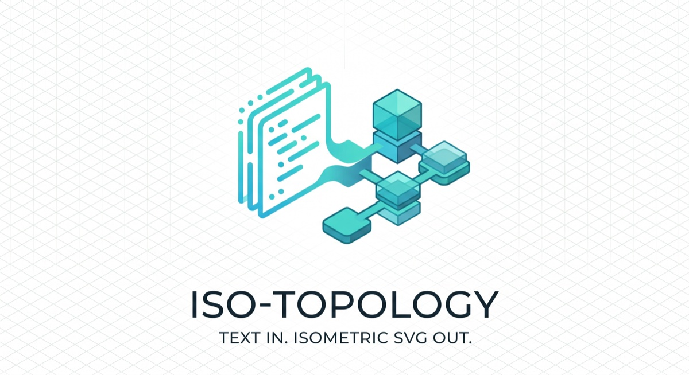
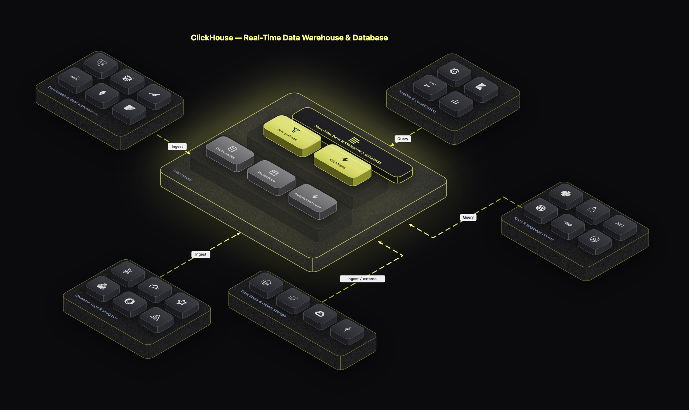
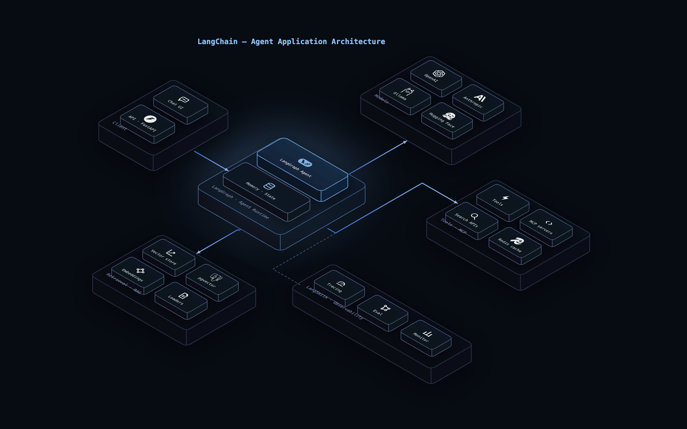
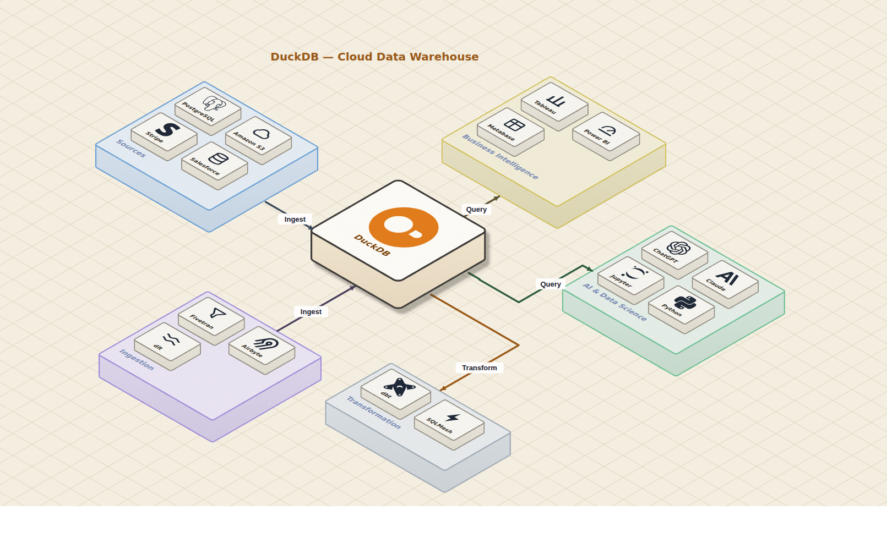
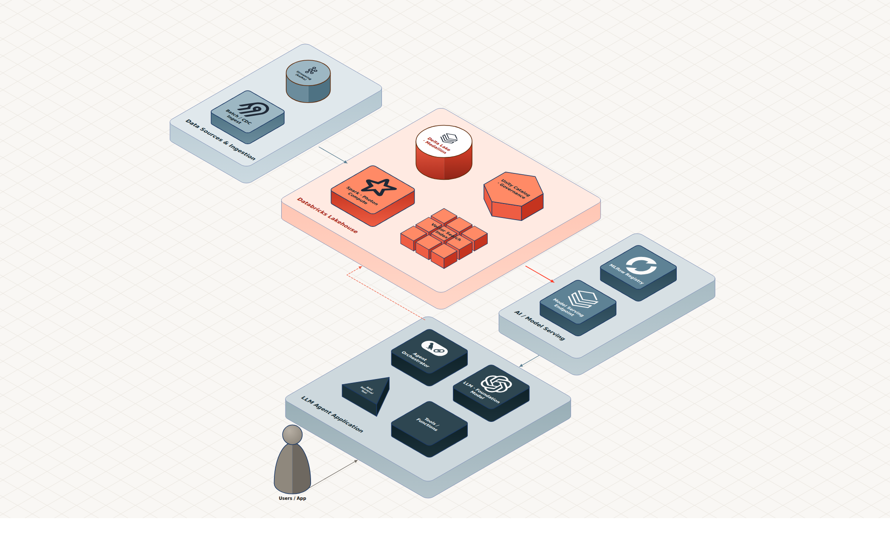
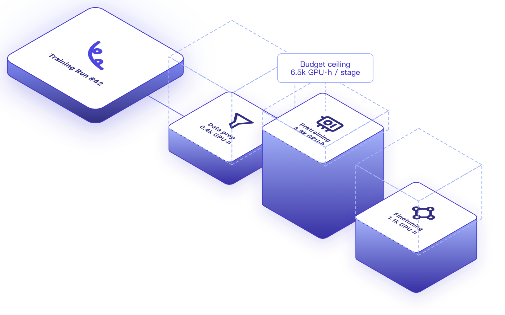

<div align="center">



# iso-topology — isometric architecture diagrams as code

[](LICENSE)
[](https://go.dev)
[](https://pkg.go.dev/github.com/MarkovWangRR/iso-topology)

### Figma-grade isometric architecture diagrams — as code, agent-native.

**Ask your agent in plain language. Refine the same way. Commit the result.**



<sub>↑ Built by asking — *“draw a ClickHouse real-time analytics architecture, dark glass style”* — then a few plain-language tweaks (*“thicker dashed gradient connectors,” “add a diagonal grid,” “lime accent”*). No Figma, no coordinates; it's text you diff.</sub>

`single binary` · `zero runtime deps` · `renders in ms` · `200+ icons incl. real brand logos` · `every sample golden-tested`

English · [简体中文](README.zh-CN.md)

</div>

---

The only diagram-as-code tool where the output is design-grade **isometric**, the DSL is
a machine-checkable contract your agent self-corrects against, and it runs deterministically
**offline in one static binary**. The alternative is an afternoon in Figma (not diffable,
dead the moment the infra changes) or Mermaid/D2 (flat flowcharts). This gives you the
Figma look from text — generated by your agent, validated before render, committed next to
your code.

## Prefer to write it yourself? It's just text.

Presets define the look once; `layout` / `place` relations do the positioning — never
pixel coordinates. From this:

```yaml
theme:
  presets:
    heroBlue:                                  # the one glowing accent, reused by name
      stroke: { color: "#6FA8E0", width: 1.6 }
      faces: { top: { fill: { kind: linearGradient, stops: [ {offset: 0, color: "#1A3550"}, {offset: 1, color: "#0E1C30"} ] } } }
      effects: { faceSplit: true, backglow: { color: "#6BA8E8", radius: 70 } }
nodes:
  scene:
    parts:
      - id: runtime
        shape: group
        layout: { mode: column }               # ← auto-arranged, no coordinates
        parts:
          - { id: agent,  preset: heroBlue, icon: "iso://si/langchain/8FBEEF", label: "LangGraph Agent" }
          - { id: memory, icon: "iso://glyph/database", label: "Memory · State" }
    connectors:
      - { from: client, to: runtime, routing: orthogonal,
          stroke: { gradient: { from: "#3B6FD4", to: "#8FBEEF" } } }   # glowing flow
```

…renders to this — a typical LangChain agent app, in LangChain's own dark/cool-blue style:



A deterministic solver turns relations into geometry — every scene here is coordinate-free.
[Source](samples/topology/langchain-app/input.yaml).

## Start in 60 seconds

**By hand** — one static binary, no browser or fonts needed:

```bash
go install github.com/MarkovWangRR/iso-topology/cmd/isotopo@latest
echo 'user -> api -> db' > scene.d2     # any d2 graph → auto-layout
isotopo render scene.d2 ./out           # → out/topology.svg (+ html + per-node SVGs)
isotopo serve  scene.d2                 # → localhost:8731 — drag, restyle, export
```

**With your agent** (Claude Code, Cursor, …) — wire it up once (commands below are tested):

```bash
go install github.com/MarkovWangRR/iso-topology/cmd/isotopo@latest      # the renderer
go install github.com/MarkovWangRR/iso-topology/cmd/isotopo-mcp@latest  # MCP server
claude mcp add isotopo -- isotopo-mcp                                   # register with Claude Code
```

Then just ask in plain language and refine the same way — the agent runs the
`capabilities → validate → render` loop for you:

> *"draw a ClickHouse real-time analytics architecture, dark glass style"*
> *"make the connectors thicker, dashed, with a gradient"*
> *"add a diagonal grid to the background and brighten the node borders"*

That's the whole workflow: **ask → tweak**. Prefer a Claude Code skill over MCP?
`git clone` the repo and run `scripts/install-skill.sh`. The full system prompt is in
[PROMPT_TEMPLATE.md](docs/agent/PROMPT_TEMPLATE.md); [`llms.txt`](llms.txt) covers other runtimes.

## The loop your agent runs

iso-topology speaks contract, not vibes — your agent discovers the DSL, emits a
scene, gets machine-checkable feedback, and converges with no human in the loop:

```bash
isotopo capabilities          # machine-readable DSL inventory — read once
isotopo validate scene.yaml   # JSONPath-located issues + "did you mean" fixes (exit 0/2/3)
isotopo evaluate scene.yaml   # layout scorecard: crossings / overlaps / edge-tunnelling
isotopo render   scene.yaml out
isotopo preview  scene.yaml out.svg core edge:3   # crop ONE node / group / edge
```

`validate` is a JSON-schema lint with fix suggestions; `evaluate` scores layout
quality from a deterministic plan view; both let an agent self-correct before it ever
looks at pixels. Output is byte-deterministic — same input, same SVG — which is what
makes the golden-file tests and clean git diffs work.

## MCP server

`isotopo-mcp` exposes the whole loop to any MCP client (Claude Code, Claude
Desktop, Cursor, …) as five stdio tools — `iso_capabilities`, `iso_validate`,
`iso_evaluate`, `iso_render`, `iso_preview` — so an agent draws *and*
self-corrects (validate → evaluate → render) without shelling out to the CLI:

```bash
go install github.com/MarkovWangRR/iso-topology/cmd/isotopo-mcp@latest
claude mcp add isotopo -- isotopo-mcp        # Claude Code
```

Claude Desktop / Cursor / any generic client — add to its MCP config:

```json
{
  "mcpServers": {
    "isotopo": { "command": "isotopo-mcp" }
  }
}
```

Full tool reference + the MCP-shaped loop: [docs/agent/MCP.md](docs/agent/MCP.md).

## Studio — point, drag, restyle

```bash
isotopo serve input.yaml        # → http://localhost:8731
```


The rendered scene on the left, its YAML on the right, sub-second feedback between.
**Drag to lay out**, drag a node in/out of a group, **right-click to restyle**,
add / delete / duplicate / connect nodes, toggle ◳ iso / ◰ plan, undo/redo, and
export SVG / PNG / YAML. Every edit is an in-browser copy — the file on disk is never
touched until you hit save. Tour: [docs/guides/studio.md](docs/guides/studio.md).

## What you can draw

- **18 iso primitives** — boxes, cylinders, prisms (tri/hex/oct), racks, arrays
  (1D/2D/3D), clouds, people, boundaries (VPC/zone), wedges, custom polygons —
  picked by *role*, not all rectangles.
- **Coordinate-free layout** — `place: {rightOf|behind|above…, gap}` relations and
  `layout: {mode: row|column|grid|ring|auto}` containers (auto = connector-driven
  DAG). A solver computes positions, validates references, and warns on overlap.
- **Design-grade styling** — per-face solid or gradient fills, translucent **glass**,
  **grain**, `faceSplit` lighting, dot/hatch patterns (iso-projected), drop shadows,
  backglow, rounded corners, wireframe.
- **Connectors that read as systems** — `orthogonal` (rides the iso grid) / `straight`
  / `bezier`, with dashes, gradients, waypoints, and labels.
- **Two projections from one source** — the design-grade **isometric** view (default),
  or a flat **2D top-down** "documentation" view when you want maximum legibility over
  visual flair. Switch per-render with `--projection top` or per-scene with
  `canvas: { projection: top }` — same DSL, same layout solver, no rewrite.
  See [`samples/topology/plan-view-2d`](samples/topology/plan-view-2d/input.yaml).
- **Named themes + semantic roles** — write pure topology (`role: hero | tray | chip`)
  and pick a look: `--theme clickhouse-dark | navy-glass | handdrawn-paper | clean-light`
  (or `theme: { use: <name> }` in the DSL). The theme supplies the design system —
  role styles, sizing rhythm, text, canvas, even icon ink adapted to dark fills — so
  the same scene re-skins coherently, and a plain `.d2` graph gets the full look from
  one flag.
- **One-flag readability** — `isotopo render --readable` layers a legibility-first
  "documentation" profile over any scene: upright screen labels with a canvas-aware
  contrast chip and a padding floor. Opt-in and non-destructive — it only fills gaps
  you left blank, so hand-tuned scenes keep their look.
- **200+ recolorable icons** — 150+ real brand logos (Simple Icons, CC0) plus 35
  concept glyphs; tint any with `/RRGGBB` or `/light`.
- **Reusable looks** — `theme.presets` plus 28 ready-to-copy
  [style references](samples/style_refer): pick a visual language by mood, copy
  its `theme.presets` + `canvas`, then layer your topology on top.

Full machine-readable inventory: `isotopo capabilities` (or
[CAPABILITIES.md](docs/agent/CAPABILITIES.md)).

## Gallery

**ClickHouse ecosystem** — dark frosted-glass hub-and-spoke, one neon accent. [Source](samples/topology/clickhouse-hub/input.yaml)


**DuckDB data architecture** — hand-drawn: warm paper, iso grid, film grain. [Source](samples/topology/duckdb-handdrawn/input.yaml)



**Databricks Lakehouse + LLM agent** — brand-faithful, single lava accent on a warm canvas. [Source](samples/topology/lakehouse-agent/input.yaml)



**Training compute** — light canvas, dashed budget "ghost" volumes. [Source](samples/topology/training-compute/input.yaml)



## Why isometric, and why this tool

Flat 2D reads as a list of boxes; iso reads as a **system** — the depth axis
separates edge / mid-tier / data layers at a glance, and stacked nodes express
replicas and HA. Hand-drawing that in Figma scales to ~ten elements and zero people
on the diff.

| | Mermaid / D2 | Figma / draw.io | **iso-topology** |
|---|---|---|---|
| Visual register | flat flowchart | design-grade | **design-grade isometric** |
| Text source, git-diffable | ✓ | ✗ | ✓ |
| Agent discovers + validates the DSL | ✗ | ✗ | **✓ (`capabilities` + `validate`)** |
| Layout without hand-tuned coordinates | ✓ | ✗ | ✓ (`place` / `layout` solver) |
| Offline single binary | partial | ✗ | ✓ |

## Use as a Go library

```go
import isotopo "github.com/MarkovWangRR/iso-topology"

svg, issues, _ := isotopo.RenderSource("yaml", yamlBytes)            // DSL → one SVG

op := isotopo.EditOp{Kind: "move", Target: "node", ID: "api", DWX: 50}
newSrc, svg, issues, _ := isotopo.ApplyOp("yaml", yamlBytes, op)     // stateless canvas edit, comments preserved
```

The stateless edit contract powers Studio and client-side WASM editors. Full surface:
the [API reference](docs/reference/api.md) ([godoc](https://pkg.go.dev/github.com/MarkovWangRR/iso-topology)).

## Docs

Full index at [docs/README.md](docs/README.md).

- **Start:** [Tutorial](docs/getting-started/01-install.md) · [Recipes](docs/agent/RECIPES.md) · [Scene design](docs/guides/scene-design.md)
- **Reference:** [API](docs/reference/api.md) · [CLI](docs/reference/cli.md) · [YAML DSL](docs/reference/dsl-yaml.md) · [d2 DSL](docs/reference/dsl-d2.md) · [Style/Theme](docs/reference/dsl-theme.md)
- **Agents:** [CAPABILITIES](docs/agent/CAPABILITIES.md) · [PROMPT_TEMPLATE](docs/agent/PROMPT_TEMPLATE.md) · [SAMPLES](docs/agent/SAMPLES.md) · [schema](docs/agent/schema/dsl.schema.json) · [MCP](docs/agent/MCP.md) · [skills](skills/README.md)

## Status & contributing

Single-author project, moving fast — pin a tag if you depend on it (the `d2`
dependency is locked at `v0.7.1`). Issues and PRs welcome; run `go test ./...` first —
`samples/*/*/expected.svg` are golden files that catch output drift. Drew something
cool? Open an issue with your scene + SVG and the best ones get linked here. ⭐ helps
others find it.

## License

Apache License 2.0 — see [LICENSE](LICENSE). Rendered output is yours to use
commercially; bundled brand logos are CC0 from [Simple Icons](https://simpleicons.org).
</content>
