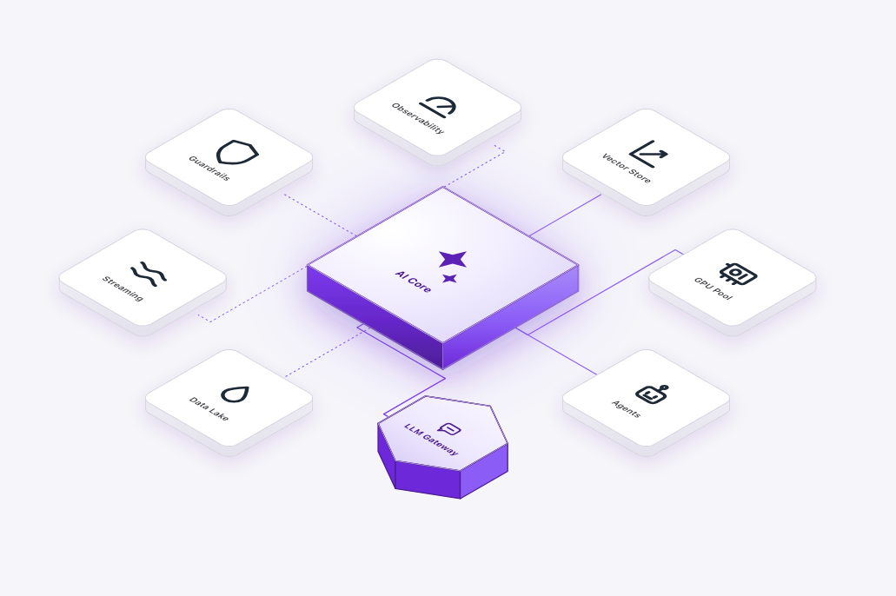
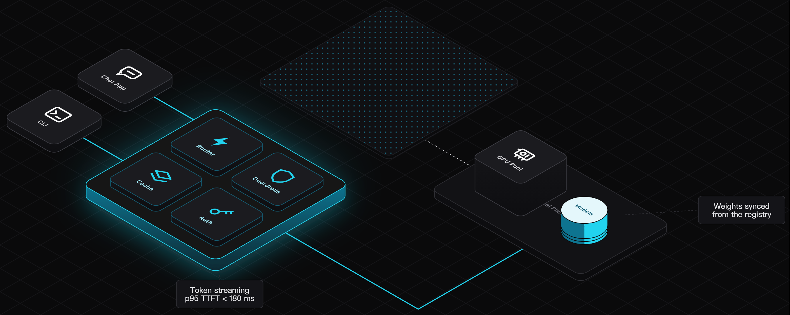
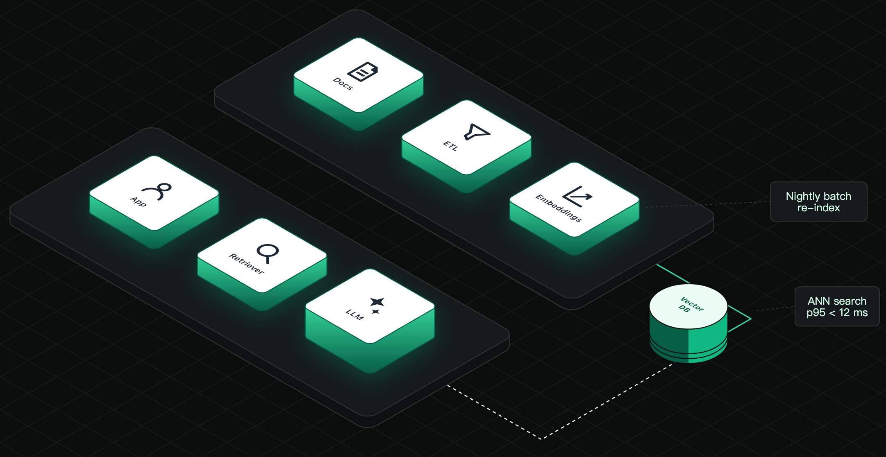
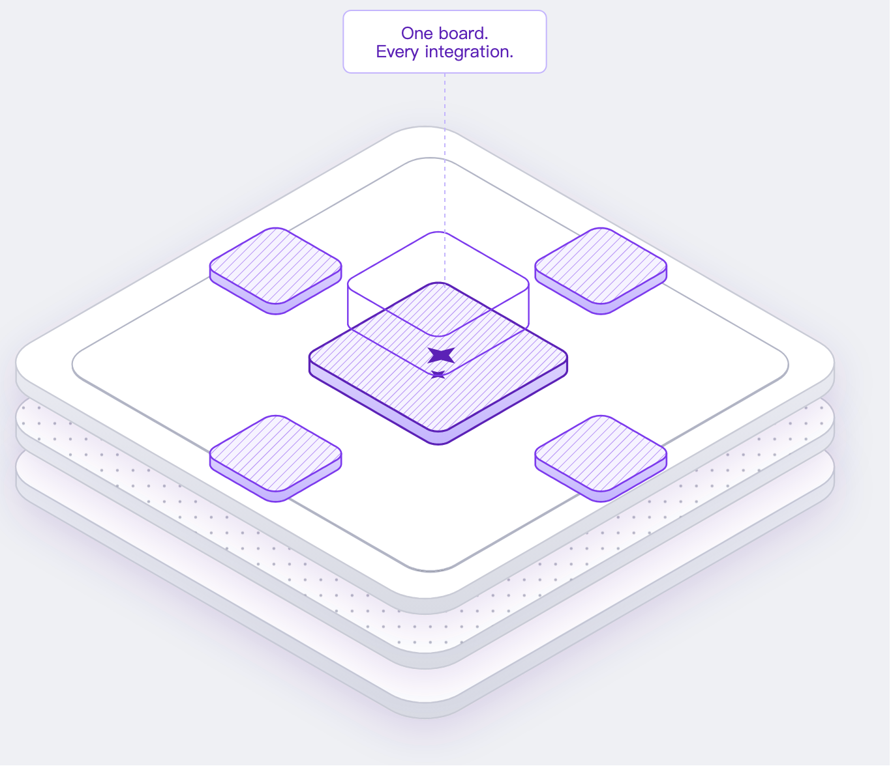
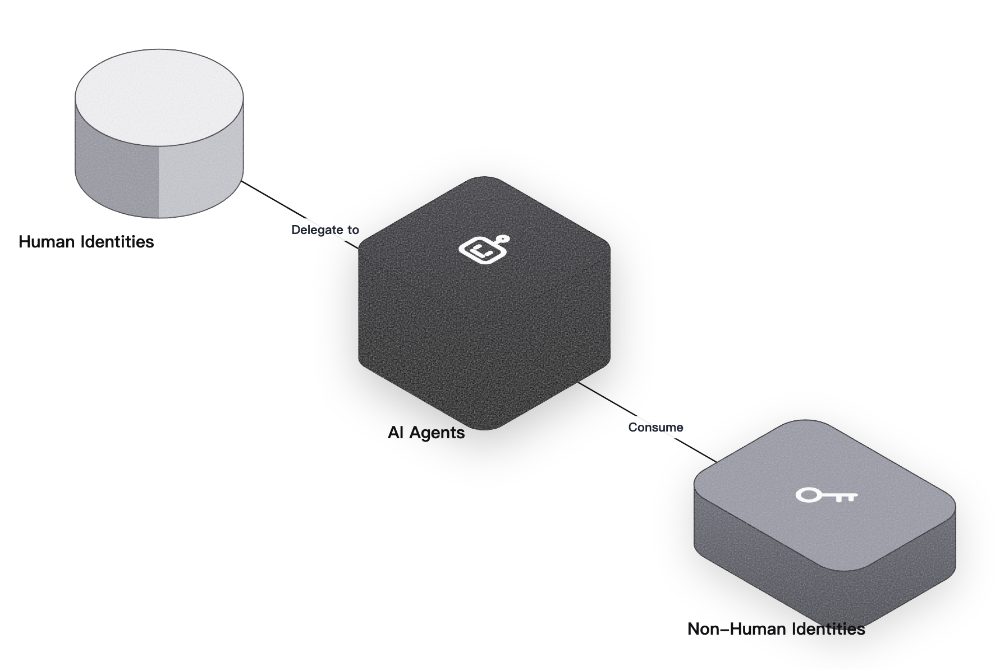
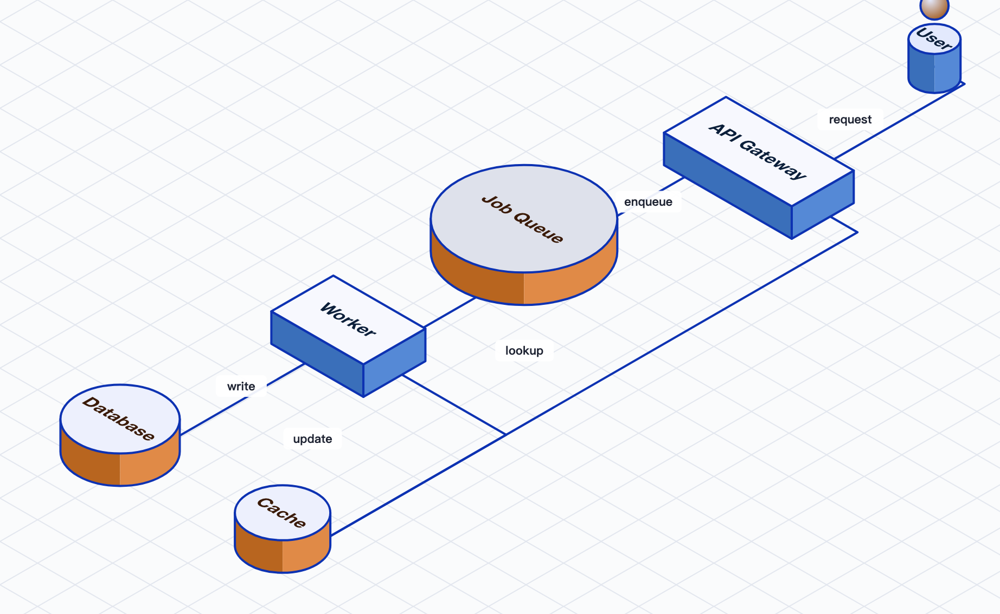

<div align="center">


# iso-topology：用代码画 2.5D 等距架构图

[](LICENSE)
[](https://go.dev)
[](https://pkg.go.dev/github.com/MarkovWangRR/iso-topology)

**写一段文本，得到一张等距 SVG 架构图。AI agent 可以自己生成、自己校验、和代码一起提交。**

单个静态二进制 · 无运行时依赖 · 毫秒级渲染 · 内置 35 个图标 · 所有样例都有 golden 测试

[English](README.md) · 简体中文

</div>

---

iso-topology 是一个开源的 Go 命令行工具（也可作为库使用）。它把一种很小的文本 DSL 渲染成 2.5D 等距风格的 SVG 架构图，效果接近设计师手绘的官网配图。

它从第一天起就是为 AI agent 设计的：DSL 小到模型一次就能写对；渲染之前可以先校验，写错了会收到"你是不是想写 cylinder"这样的具体建议；同样的输入永远渲染出同样的文件，所以图可以放进 Git 仓库，像代码一样 review 和 diff。

当然，人手写也完全没问题。

## 输入是这样一段文本……

```yaml
nodes:
  scene:
    shape: composite
    parts:
      - id: core                          # 主角，场景围绕它展开
        shape: rectangle
        geom: { w: 170, d: 170, h: 24 }
        icon: "iso://glyph/sparkles/7C5CFC"
        label: "AI Core"
        style:
          effects: { cornerRadius: 14, backglow: { color: "#A78BFA", radius: 46 } }
      - id: llm
        place: { behind: core, gap: 2.6 } # ← 只写位置关系，不写坐标
        icon: "iso://glyph/chat"
        label: "LLM Gateway"
      # ……其余七个节点，每个也只是一条 place 规则
```

## ……输出就是这张图



这份 README 里的每一张图，位置全部由 `place`（节点间关系）和 `layout`（容器排布）自动求解，没有一个手写坐标。这张图的完整源码：[samples/topology/ai-platform/input.yaml](samples/topology/ai-platform/input.yaml)。

## 上手：把下面这段话直接粘给 Claude

新电脑不用看安装文档。把下面整段粘进 Claude Code（或其他编码 agent），它会装好全部环境、渲染一张样例图验收，最后告诉你以后该怎么提需求：

````markdown
Set up the iso-topology diagram toolchain on this machine, then teach
me how to use it. Work autonomously; only stop if something needs my
password or a decision only I can make. Reply in the language I use.

## 1 · Install (idempotent — skip whatever is already present)
- Ensure Go ≥ 1.25 (`go version`); if missing, install it with the
  system package manager (macOS: `brew install go`; Debian/Ubuntu:
  `sudo apt install golang-go`; otherwise https://go.dev/dl).
- `go install github.com/MarkovWangRR/iso-topology/cmd/isotopo@latest`
- `go install github.com/MarkovWangRR/iso-topology/cmd/isotopo-mcp@latest`
- Ensure `$(go env GOPATH)/bin` is on PATH for this session.
- Install the drawing skill so future sessions already know the
  workflow:
  `mkdir -p ~/.claude/skills/draw-iso-diagram && curl -sL https://raw.githubusercontent.com/MarkovWangRR/iso-topology/main/skills/draw-iso-diagram/SKILL.md -o ~/.claude/skills/draw-iso-diagram/SKILL.md`

## 2 · Verify with a real render
- `isotopo capabilities | head -20` must print JSON.
- Render the showcase sample into ./diagrams/hello:
  `curl -sL https://raw.githubusercontent.com/MarkovWangRR/iso-topology/main/samples/topology/ai-platform/input.yaml -o /tmp/hello.yaml && isotopo render /tmp/hello.yaml ./diagrams/hello`
- Open ./diagrams/hello/topology.html and tell me what I should see.

## 3 · From now on, whenever I ask for a diagram
- Read `isotopo capabilities` once per session; imitate the closest
  fixture from
  https://raw.githubusercontent.com/MarkovWangRR/iso-topology/main/docs/agent/SAMPLES.md
  and follow the visual rules in
  https://raw.githubusercontent.com/MarkovWangRR/iso-topology/main/docs/guides/scene-design.md
- Author YAML with layout/place relations ONLY — never hand-computed
  coordinates; connectors are always routing: orthogonal.
- Loop `isotopo validate <file>` until exit 0, then render into
  ./diagrams/<kebab-case-name>/ and give me the topology.html path.
- Keep the YAML next to the output as input.yaml; when I ask for
  changes, edit it and re-render the same folder.

## 4 · Finish by telling me
- three example requests that show off what this tool does well, and
- how I should phrase change requests so you can apply them precisely.
````

装好之后，你只需要做两件事：**提需求**（比如"画一下我们的 RAG 链路，暗色背景，绿色点缀，向量库放最显眼的位置"）和**提修改**（比如"把缓存挪到网关右边"）。每张图都固定输出在 `./diagrams/图名/topology.html`，浏览器开着这个文件，改完刷新就能看到。

需求怎么措辞、出了问题怎么调，详见[新手指南](docs/getting-started/00-onboarding.md)。

## 快速开始（自己动手）

```bash
# 安装。单个静态二进制，放进 CI 镜像或容器都行
go install github.com/MarkovWangRR/iso-topology/cmd/isotopo@latest

# 渲染上面那张 AI 平台图
curl -sLO https://raw.githubusercontent.com/MarkovWangRR/iso-topology/main/samples/topology/ai-platform/input.yaml
isotopo render input.yaml ./out
open ./out/topology.html        # 左边是图，右边是可编辑的源码
```

也可以先用三行 d2 跑通流程，布局全自动：

```bash
echo 'user -> api -> db' > scene.d2
isotopo render scene.d2 ./out
```

## 给 agent 用的三件套

agent 画图靠的不是模型的手感，而是一套明确的契约。三条命令构成闭环：

```bash
isotopo capabilities          # DSL 能力清单，机器可读，每个会话读一次
isotopo validate scene.yaml   # 校验。每个问题都带位置和修复建议
isotopo render   scene.yaml out
```

举个例子，agent 写错了形状名，`validate` 会这样回话，照着 `suggest` 改完重跑就行：

```json
{
  "issues": [
    {
      "severity": "error",
      "path": "nodes.scene.parts[0].shape",
      "message": "unknown shape \"cilinder\"",
      "suggest": "cylinder"
    }
  ]
}
```

退出码约定：`0` 通过，`2` 只有警告，`3` 有错误，可以直接接 CI。布局问题也会被查出来：引用了不存在的节点、位置关系成环、求解后节点重叠（精确指出是哪两个撞了）。

想让 Claude、Cursor 或者任何模型马上会画？把这段话塞进系统提示词即可：

```text
You can render iso architecture diagrams. Generate DSL using the
schema at docs/agent/schema/dsl.schema.json and the reference at
docs/agent/CAPABILITIES.md; imitate the fixture from
docs/agent/SAMPLES.md that best matches the task. Use
`isotopo validate <file>` to check before claiming done.
```

完整版的系统提示词在 [PROMPT_TEMPLATE.md](docs/agent/PROMPT_TEMPLATE.md)，其中的能力清单部分是从代码直接生成的，不会过时。

更深度的两种集成也在仓库里：

- **MCP 服务**：`isotopo-mcp` 把校验和渲染做成了 MCP 工具，Claude Code / Claude Desktop / Cursor 不用跑 shell 命令就能画图。一行注册：`claude mcp add isotopo -- isotopo-mcp`，详见 [MCP 配置](docs/agent/MCP.md)。
- **Claude Code 技能**：[`skills/draw-iso-diagram`](skills/draw-iso-diagram/SKILL.md) 把完整的画图流程（查能力、找样例模仿、写 YAML、校验、渲染）和视觉规范打包成一个可安装的技能：`cp -r skills/draw-iso-diagram ~/.claude/skills/`。

仓库根目录还有一份同样自动生成的 [`llms.txt`](llms.txt)，方便各类 AI 搜索和 agent 爬虫认识这个项目。

## 画廊

### LLM 推理平台（暗色）



聊天应用和命令行的请求穿过中央的服务网关。网关是一块 `layout: grid` 自动排布的面板，路由、安全护栏、缓存、鉴权四个格子各带一个青色图标。后方是模型层：GPU 集群和一摞模型仓库副本。[源码](samples/topology/llm-serving/input.yaml)。

### RAG 链路（暗色）



后面一块底座做数据接入和索引（文档 → 清洗 → 向量化），前面一块做在线服务（应用 → 检索 → 大模型），两块之间立着共享的向量数据库副本堆。检索器查库的那条虚线沿着网格走。[源码](samples/topology/rag-pipeline/input.yaml)。

### 训练算力账单（亮色）


一次训练的 GPU 时间花在哪：三根渐变柱体，顶面直接标着图标和小时数；柱体上方的虚线框是各阶段的预算上限，一眼看出哪段还有富余。[源码](samples/topology/training-compute/input.yaml)。

### 平台电路板（亮色）



官网首页那种质感：三层白板悬空叠起（每层就是一条 `place: {above}`），紫色斜纹的芯片之间走着粗走线，再加上虚线内框、点阵纹理和悬在主芯片上方的线框。[源码](samples/topology/platform-board/input.yaml)。

### 身份流转（白底印刷质感）



完全不同的画风：白底上三个带胶片颗粒质感的深色物体，连线上挂着小标签，说明文字用粗体排在画面下方，像一页杂志广告。颗粒来自 `effects.grain` 一个参数。[源码](samples/topology/identity-flow/input.yaml)。

### 三行 d2 画微服务（全自动布局）



```d2
user:   User { shape: person }
api:    API Gateway
db:     Database { shape: cylinder }
user -> api: request
api  -> db:  write
```

一个位置都不用写：dagre（或 ELK）负责排版，iso-topology 负责把平面图变成 2.5D。[源码](samples/topology/microservice/input.d2)。

## 为什么做这个工具

平面流程图看起来是一堆框；等距图看起来是一个**系统**：纵深方向天然分出接入层、中间层、数据层，叠起来的方块一眼就是"多副本"。但在 Figma 里手绘等距图，画到十来个元素就到头了，而且改一版同事根本没法 review。

|  | Mermaid | D2 | Figma / draw.io | **iso-topology** |
|---|---|---|---|---|
| 源文件 | 文本 | 文本 | 画布 | **文本（YAML / d2 / JSON）** |
| 视觉效果 | 流程图 | 流程图 | 设计稿水准 | **设计稿水准的等距图** |
| 能进 Git diff | ✓ | ✓ | ✗ | ✓ |
| agent 可查询 DSL 能力 | ✗ | ✗ | ✗ | ✓（`capabilities`） |
| 渲染前校验、带修复建议 | ✗ | ✗ | ✗ | ✓ |
| 不用手调坐标 | ✓ | ✓ | ✗ | ✓（`place`/`layout` 求解器） |
| 离线单文件运行 | ✗（要浏览器/node） | ✓ | ✗ | ✓ |

## 两种写法

| 写法 | 特点 | 适合 |
|---|---|---|
| `.d2` | dagre / ELK 全自动布局 | agent 从图数据批量生成、结构经常变的图 |
| `.yaml` | 声明式构图：`layout` 容器 + `place` 关系，零坐标 | 精心设计的场景、官网配图、信息图 |

两种写法最终走同一个渲染管线，输出结构完全一样。参考：[d2 语法](docs/reference/dsl-d2.md)、[YAML 语法](docs/reference/dsl-yaml.md)。

## 能力一览

- **23 种 d2 形状**自动映射到等距图形（rectangle、cylinder、cloud、person、hexagon、queue、oval……）
- **声明式定位**：`layout: {mode: row|column|grid|ring}` 排容器，`place: {rightOf|inFrontOf|above: 某节点}` 摆单件；坐标由求解器计算，引用错了会报错，撞了会警告
- **8 个组合原语**：`group`、`stack`、`layout`、`place`、`canvas.grid`、`annotation`、`connector`、图标
- **35 个内置图标**：18 个 AI / 大数据主题的图形（`iso://glyph/gpu`、`model`、`agent`、`vector`、`lake`……）可任意配色，另有一组品牌字母徽章（`iso://brand/kafka`……）
- **逐面样式**：渐变、投影、辉光、斜纹/点阵纹理、圆角、线框模式、胶片颗粒
- **风格预设**：`theme.presets` 里定义一次，节点上写 `preset: 名字` 即可复用（比 YAML 锚点强：JSON 也能用，写错名字会提示）
- **两层输出**：整图 SVG，外加每个元素一张独立 SVG

机器可读的完整清单：`isotopo capabilities`。

## 输出了什么

```
out/
├── topology.svg              整张图
├── topology.html             图和可编辑源码并排显示
├── topology.<yaml|d2|json>   源文件备份
└── nodes/
    ├── _index.html           元素总览
    ├── <id>.svg              单个元素的独立 SVG
    ├── <id>.html             嵌入用的代码片段
    └── <id>.yaml             可单独再渲染的源码片段
```

## 当 Go 库用

```go
import isotopo "github.com/MarkovWangRR/iso-topology"

doc, _ := isotopo.Parse(yamlBytes)
svg := isotopo.RenderWithCanvas(doc.Scene(), doc.Theme, doc.Canvas, doc.Annotations)
```

完整 API 见 [docs/reference/cli.md](docs/reference/cli.md)。

## 常见问题

**和 Mermaid / D2 有什么区别？**
Mermaid 和 D2 画的是流程图；iso-topology 画的是那种以前要请设计师在 Figma 里磨一下午的官网配图，同时源文件还是文本，能进 Git。另外它是三者中唯一为 agent 设计的：能力可查询、写完可校验、错误带修复建议。

**ChatGPT / Claude / 我自己的 agent 能直接用吗？**
能，这正是它的设计出发点。agent 先读 [`isotopo capabilities`](docs/agent/CAPABILITIES.md)（或 [JSON Schema](docs/agent/schema/dsl.schema.json)）了解能写什么，写完用 `isotopo validate` 自查自纠。现成的系统提示词在 [PROMPT_TEMPLATE.md](docs/agent/PROMPT_TEMPLATE.md)；用 MCP 的话一行接入：`claude mcp add isotopo -- isotopo-mcp`。

**要自己摆位置吗？**
不用。节点位置全部用关系描述（"在网关右边，隔两格"），容器内部用 `layout` 自动排，坐标由求解器算出来。`offset` 只用来做最后的微调。这份 README 里每张图都没写过坐标。

**渲染需要浏览器、字体或者联网吗？**
都不需要。一个静态编译的 Go 程序，没有 CGO，不依赖系统字体，不联网。而且渲染是确定性的：输入不变，输出的文件一个字节都不会变——golden 测试和干净的 Git diff 都建立在这上面。

**生成的图可以商用吗？**
可以。Apache 2.0 协议，渲染产物也包含在内。内置的品牌徽章是原创的字母标识，不是对商标 logo 的复制。

## 文档

按用途分类，总索引在 [docs/README.md](docs/README.md)。

- **入门**：[新手指南](docs/getting-started/00-onboarding.md) · [手动教程](docs/getting-started/01-install.md) · [常用写法速查](docs/agent/RECIPES.md) · [画面设计指南](docs/guides/scene-design.md) · [问题排查](docs/guides/troubleshooting.md)
- **参考**：[CLI 与库](docs/reference/cli.md) · [YAML 语法](docs/reference/dsl-yaml.md) · [d2 语法](docs/reference/dsl-d2.md) · [样式与主题](docs/reference/dsl-theme.md) · [输出结构](docs/reference/output-layout.md)
- **Agent 集成**：[CAPABILITIES.md](docs/agent/CAPABILITIES.md) · [PROMPT_TEMPLATE.md](docs/agent/PROMPT_TEMPLATE.md) · [SAMPLES.md](docs/agent/SAMPLES.md) · [dsl.schema.json](docs/agent/schema/dsl.schema.json) · [MCP](docs/agent/MCP.md) · [skills/](skills/README.md)
- **设计思路**：[为什么选等距](docs/concepts/why-isometric.md) · [如何扩展](docs/guides/extending.md)

## 路线图

- 圆柱、球体侧面的纹理支持
- 更多图标包
- 渲染期视觉检查（重叠、裁切等问题输出成 JSON 诊断）

## 项目状态

个人项目，迭代较快，依赖它请锁定版本 tag。`oss.terrastruct.com/d2` 锁定在 `v0.7.1`。

## 参与和分享

欢迎提 issue 和 PR。提交前请跑 `go test ./...`：`samples/*/*/expected.svg` 是 golden 文件，渲染结果有任何变动都会被它拦住。

**画出了得意之作？** 开个 issue 贴上源码和 SVG，优秀作品会收进画廊。如果这个工具帮你省了一下午画图时间，点个 ⭐ 让更多人看到它。

## 许可证

Apache License 2.0，见 [LICENSE](LICENSE)。
