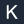

# Built-in icons

Generated from `iso25d.IconCatalog()` — the icons themselves are
maintained as Go string literals in `iso25d/brand_icons.go`, and
this index (plus the SVG files in `docs/assets/icons/`) is
regenerated by `go run ./tools/gen-docs`. Do not edit by hand.

Usage on any part: `icon: "iso://glyph/<name>"` (ink, for light
tops), `iso://glyph/<name>/light` (white, for dark tops),
`iso://glyph/<name>/<RRGGBB>` (any color), or
`iso://brand/<name>` for letter badges.

**Custom icons.** Beyond the built-ins, `icon` accepts an http(s)
URL, a `data:` URI, or a **local image file path** (svg/png/jpg/
gif/webp — absolute or relative, `~` and `file://` accepted). Local
paths are read and inlined as a data URI at render time, so the
output SVG stays self-contained. In Studio, the Edit-details → Icon
field has a **Browse…** button that embeds a picked file directly.

## Glyphs

| | Name | URI | Description |
|---|---|---|---|
|  | `agent` | `iso://glyph/agent` | robot face with antenna — AI agent, bot |
|  | `bell` | `iso://glyph/bell` | bell with clapper — notifications, alerts |
|  | `bolt` | `iso://glyph/bolt` | lightning bolt (filled) — functions, speed, compute |
|  | `browser` | `iso://glyph/browser` | window with toolbar dots — web client, frontend |
|  | `chart` | `iso://glyph/chart` | bar chart — analytics, metrics, BI |
|  | `chat` | `iso://glyph/chat` | speech bubble with line — chat, LLM gateway, conversation |
|  | `cloud` | `iso://glyph/cloud` | cloud — external system, SaaS, hosted service |
|  | `code` | `iso://glyph/code` | angle brackets — code, SDK, developer surface |
|  | `cpu` | `iso://glyph/cpu` | chip with pins — processor, hardware, runtime |
|  | `database` | `iso://glyph/database` | database cylinder — storage, persistence |
|  | `doc` | `iso://glyph/doc` | page with folded corner — documents, files |
|  | `etl` | `iso://glyph/etl` | funnel — ETL, filtering, transformation |
|  | `gauge` | `iso://glyph/gauge` | dial with needle — observability, dashboards, SLO |
|  | `gear` | `iso://glyph/gear` | hex nut with bore — settings, infrastructure, ops |
|  | `globe` | `iso://glyph/globe` | globe with meridians — CDN, edge, world-facing |
|  | `gpu` | `iso://glyph/gpu` | wide chip with pins and core — GPU, accelerator |
|  | `graph` | `iso://glyph/graph` | four linked nodes — knowledge graph, network |
|  | `key` | `iso://glyph/key` | key on ring — API keys, credentials, access |
|  | `lake` | `iso://glyph/lake` | water drop — data lake |
|  | `layers` | `iso://glyph/layers` | two stacked rhombi — cache layers, tiers, stack |
|  | `lock` | `iso://glyph/lock` | padlock — auth, secrets, encryption |
|  | `mobile` | `iso://glyph/mobile` | phone outline — mobile client |
|  | `model` | `iso://glyph/model` | four connected nodes — neural net, ML model |
|  | `queue` | `iso://glyph/queue` | three horizontal bars — queue, log, buffer |
|  | `rocket` | `iso://glyph/rocket` | rocket with porthole — launch, deploy, startup |
|  | `search` | `iso://glyph/search` | magnifier — search, retrieval, lookup |
|  | `shield` | `iso://glyph/shield` | shield — security, WAF, guardrails |
|  | `sparkles` | `iso://glyph/sparkles` | four-point stars (filled) — GenAI, magic, LLM |
|  | `stream` | `iso://glyph/stream` | double wave — streaming, realtime data |
|  | `table` | `iso://glyph/table` | grid with header — dataset, table, spreadsheet |
|  | `terminal` | `iso://glyph/terminal` | window with prompt — CLI, shell, developer tool |
|  | `training` | `iso://glyph/training` | descending curve with two points — model training, gradient descent |
|  | `user` | `iso://glyph/user` | head and shoulders — human actor, account |
|  | `vector` | `iso://glyph/vector` | axes with rising arrow — embeddings, vector store |
|  | `warehouse` | `iso://glyph/warehouse` | gabled building — data warehouse |

## Brand logos (Simple Icons)

Real logos vendored from [Simple Icons](https://simpleicons.org)
(CC0-1.0; see `iso25d/icons/si/NOTICE.txt` — brand names and
logos may be trademarks of their respective owners). Same color
variants as glyphs: `/light` for dark tops, `/<RRGGBB>` for any
color. Curate the set in `tools/import-icons/allowlist.txt`.

| | Name | URI | Description |
|---|---|---|---|
|  | `airbyte` | `iso://si/airbyte` | Airbyte logo — ETL / data integration (Simple Icons, CC0) |
|  | `alibabacloud` | `iso://si/alibabacloud` | Alibaba Cloud logo — cloud provider (Simple Icons, CC0) |
|  | `alpinelinux` | `iso://si/alpinelinux` | Alpine Linux logo — Linux distribution (container-optimized) (Simple Icons, CC0) |
|  | `angular` | `iso://si/angular` | Angular logo — web framework (frontend) (Simple Icons, CC0) |
|  | `ansible` | `iso://si/ansible` | Ansible logo — infrastructure as code / configuration management (Simple Icons, CC0) |
|  | `anthropic` | `iso://si/anthropic` | Anthropic logo — LLM / AI platform (Simple Icons, CC0) |
|  | `apache` | `iso://si/apache` | Apache logo — open-source software foundation (Simple Icons, CC0) |
|  | `apacheairflow` | `iso://si/apacheairflow` | Apache Airflow logo — workflow orchestration (Simple Icons, CC0) |
|  | `apachecassandra` | `iso://si/apachecassandra` | Apache Cassandra logo — NoSQL database (Simple Icons, CC0) |
|  | `apachecouchdb` | `iso://si/apachecouchdb` | Apache CouchDB logo — NoSQL database (Simple Icons, CC0) |
|  | `apacheflink` | `iso://si/apacheflink` | Apache Flink logo — stream processing / ETL (Simple Icons, CC0) |
|  | `apachehadoop` | `iso://si/apachehadoop` | Apache Hadoop logo — distributed data processing (Simple Icons, CC0) |
|  | `apachehive` | `iso://si/apachehive` | Apache Hive logo — data warehouse / big data SQL (Simple Icons, CC0) |
|  | `apachekafka` | `iso://si/apachekafka` | Apache Kafka logo — message queue / streaming (Simple Icons, CC0) |
|  | `apachepulsar` | `iso://si/apachepulsar` | Apache Pulsar logo — message queue / streaming (Simple Icons, CC0) |
|  | `apachespark` | `iso://si/apachespark` | Apache Spark logo — distributed data processing (Simple Icons, CC0) |
|  | `archlinux` | `iso://si/archlinux` | Arch Linux logo — Linux distribution (Simple Icons, CC0) |
|  | `argo` | `iso://si/argo` | Argo logo — GitOps / CI/CD (Simple Icons, CC0) |
|  | `astro` | `iso://si/astro` | Astro logo — web framework (static / SSR) (Simple Icons, CC0) |
|  | `auth0` | `iso://si/auth0` | Auth0 logo — identity / auth (Simple Icons, CC0) |
|  | `bitbucket` | `iso://si/bitbucket` | Bitbucket logo — version control / CI/CD (Simple Icons, CC0) |
|  | `bun` | `iso://si/bun` | Bun logo — JavaScript runtime / package manager (Simple Icons, CC0) |
|  | `c` | `iso://si/c` | C logo — programming language (Simple Icons, CC0) |
|  | `caddy` | `iso://si/caddy` | Caddy logo — web server / reverse proxy (Simple Icons, CC0) |
|  | `circleci` | `iso://si/circleci` | CircleCI logo — CI/CD (Simple Icons, CC0) |
|  | `clickhouse` | `iso://si/clickhouse` | ClickHouse logo — relational database / OLAP (Simple Icons, CC0) |
|  | `cloudflare` | `iso://si/cloudflare` | Cloudflare logo — CDN / edge / DDoS protection (Simple Icons, CC0) |
|  | `cockroachlabs` | `iso://si/cockroachlabs` | Cockroach Labs logo — relational database (Simple Icons, CC0) |
|  | `consul` | `iso://si/consul` | Consul logo — service mesh / service discovery (Simple Icons, CC0) |
|  | `couchbase` | `iso://si/couchbase` | Couchbase logo — NoSQL database (Simple Icons, CC0) |
|  | `cplusplus` | `iso://si/cplusplus` | C++ logo — programming language (Simple Icons, CC0) |
|  | `databricks` | `iso://si/databricks` | Databricks logo — data lakehouse platform (Simple Icons, CC0) |
|  | `datadog` | `iso://si/datadog` | Datadog logo — observability / monitoring (Simple Icons, CC0) |
|  | `dbt` | `iso://si/dbt` | dbt logo — data transformation / analytics engineering (Simple Icons, CC0) |
|  | `debian` | `iso://si/debian` | Debian logo — Linux distribution (Simple Icons, CC0) |
|  | `deno` | `iso://si/deno` | Deno logo — JavaScript / TypeScript runtime (Simple Icons, CC0) |
|  | `digitalocean` | `iso://si/digitalocean` | DigitalOcean logo — cloud provider (Simple Icons, CC0) |
|  | `discord` | `iso://si/discord` | Discord logo — team messaging / community platform (Simple Icons, CC0) |
|  | `django` | `iso://si/django` | Django logo — web framework (Python) (Simple Icons, CC0) |
|  | `docker` | `iso://si/docker` | Docker logo — container runtime (Simple Icons, CC0) |
|  | `dotnet` | `iso://si/dotnet` | .NET logo — programming language / runtime (Simple Icons, CC0) |
|  | `duckdb` | `iso://si/duckdb` | DuckDB logo — analytical database / OLAP (Simple Icons, CC0) |
|  | `elastic` | `iso://si/elastic` | Elastic logo — search engine (Simple Icons, CC0) |
|  | `elasticsearch` | `iso://si/elasticsearch` | Elasticsearch logo — search engine (Simple Icons, CC0) |
|  | `envoyproxy` | `iso://si/envoyproxy` | Envoy Proxy logo — service proxy / service mesh (Simple Icons, CC0) |
|  | `express` | `iso://si/express` | Express logo — web framework (Node.js) (Simple Icons, CC0) |
|  | `fastapi` | `iso://si/fastapi` | FastAPI logo — web framework (Python) (Simple Icons, CC0) |
|  | `firebase` | `iso://si/firebase` | Firebase logo — NoSQL database / BaaS (Simple Icons, CC0) |
|  | `flask` | `iso://si/flask` | Flask logo — web framework (Python) (Simple Icons, CC0) |
|  | `freebsd` | `iso://si/freebsd` | FreeBSD logo — operating system (Simple Icons, CC0) |
|  | `git` | `iso://si/git` | Git logo — version control (Simple Icons, CC0) |
|  | `gitea` | `iso://si/gitea` | Gitea logo — self-hosted version control (Simple Icons, CC0) |
|  | `github` | `iso://si/github` | GitHub logo — version control / code hosting (Simple Icons, CC0) |
|  | `githubactions` | `iso://si/githubactions` | GitHub Actions logo — CI/CD (Simple Icons, CC0) |
|  | `gitlab` | `iso://si/gitlab` | GitLab logo — DevOps / version control / CI/CD (Simple Icons, CC0) |
|  | `go` | `iso://si/go` | Go logo — programming language (Simple Icons, CC0) |
|  | `googlecloud` | `iso://si/googlecloud` | Google Cloud logo — cloud provider (Simple Icons, CC0) |
|  | `grafana` | `iso://si/grafana` | Grafana logo — observability / dashboards (Simple Icons, CC0) |
|  | `graphql` | `iso://si/graphql` | GraphQL logo — API query language (Simple Icons, CC0) |
|  | `helm` | `iso://si/helm` | Helm logo — Kubernetes package manager (Simple Icons, CC0) |
|  | `heroku` | `iso://si/heroku` | Heroku logo — PaaS / cloud hosting (Simple Icons, CC0) |
|  | `hetzner` | `iso://si/hetzner` | Hetzner logo — cloud / bare-metal hosting (Simple Icons, CC0) |
|  | `huggingface` | `iso://si/huggingface` | Hugging Face logo — ML / LLM platform (Simple Icons, CC0) |
|  | `influxdb` | `iso://si/influxdb` | InfluxDB logo — time-series database (Simple Icons, CC0) |
|  | `istio` | `iso://si/istio` | Istio logo — service mesh (Simple Icons, CC0) |
|  | `javascript` | `iso://si/javascript` | JavaScript logo — programming language (Simple Icons, CC0) |
|  | `jenkins` | `iso://si/jenkins` | Jenkins logo — CI/CD (Simple Icons, CC0) |
|  | `json` | `iso://si/json` | JSON logo — data format (Simple Icons, CC0) |
|  | `jupyter` | `iso://si/jupyter` | Jupyter logo — interactive computing / data science (Simple Icons, CC0) |
|  | `keras` | `iso://si/keras` | Keras logo — ML framework (Simple Icons, CC0) |
|  | `kibana` | `iso://si/kibana` | Kibana logo — log analytics / observability (Simple Icons, CC0) |
|  | `kotlin` | `iso://si/kotlin` | Kotlin logo — programming language (Simple Icons, CC0) |
|  | `kubernetes` | `iso://si/kubernetes` | Kubernetes logo — container orchestration (Simple Icons, CC0) |
|  | `langchain` | `iso://si/langchain` | LangChain logo — LLM application framework (Simple Icons, CC0) |
|  | `laravel` | `iso://si/laravel` | Laravel logo — web framework (PHP) (Simple Icons, CC0) |
|  | `linux` | `iso://si/linux` | Linux logo — operating system (Simple Icons, CC0) |
|  | `mariadb` | `iso://si/mariadb` | MariaDB logo — relational database (Simple Icons, CC0) |
|  | `minio` | `iso://si/minio` | MinIO logo — object storage (Simple Icons, CC0) |
|  | `mlflow` | `iso://si/mlflow` | MLflow logo — ML experiment tracking / model registry (Simple Icons, CC0) |
|  | `modal` | `iso://si/modal` | Modal logo — cloud compute / model serving (Simple Icons, CC0) |
|  | `mongodb` | `iso://si/mongodb` | MongoDB logo — NoSQL database (Simple Icons, CC0) |
|  | `mysql` | `iso://si/mysql` | MySQL logo — relational database (Simple Icons, CC0) |
|  | `neo4j` | `iso://si/neo4j` | Neo4j logo — graph database (Simple Icons, CC0) |
|  | `netlify` | `iso://si/netlify` | Netlify logo — JAMstack / edge hosting (Simple Icons, CC0) |
|  | `newrelic` | `iso://si/newrelic` | New Relic logo — observability / APM (Simple Icons, CC0) |
|  | `nextdotjs` | `iso://si/nextdotjs` | Next.js logo — web framework (React / SSR) (Simple Icons, CC0) |
|  | `nginx` | `iso://si/nginx` | NGINX logo — web server / reverse proxy / load balancer (Simple Icons, CC0) |
|  | `nodedotjs` | `iso://si/nodedotjs` | Node.js logo — JavaScript runtime (Simple Icons, CC0) |
|  | `numpy` | `iso://si/numpy` | NumPy logo — numerical computing library (Simple Icons, CC0) |
|  | `nuxt` | `iso://si/nuxt` | Nuxt logo — web framework (Vue / SSR) (Simple Icons, CC0) |
|  | `okta` | `iso://si/okta` | Okta logo — identity / auth (Simple Icons, CC0) |
|  | `ollama` | `iso://si/ollama` | Ollama logo — local LLM runtime (Simple Icons, CC0) |
|  | `openai` | `iso://si/openai` | OpenAI logo — LLM / AI platform (Simple Icons, CC0) |
|  | `openapiinitiative` | `iso://si/openapiinitiative` | OpenAPI Initiative logo — API specification (Simple Icons, CC0) |
|  | `openjdk` | `iso://si/openjdk` | OpenJDK logo — programming language / runtime (Simple Icons, CC0) |
|  | `opensearch` | `iso://si/opensearch` | OpenSearch logo — search engine (Simple Icons, CC0) |
|  | `openstack` | `iso://si/openstack` | OpenStack logo — open-source cloud platform (Simple Icons, CC0) |
|  | `opentelemetry` | `iso://si/opentelemetry` | OpenTelemetry logo — observability / distributed tracing (Simple Icons, CC0) |
|  | `oracle` | `iso://si/oracle` | Oracle logo — relational database (Simple Icons, CC0) |
|  | `ovh` | `iso://si/ovh` | OVH logo — cloud provider (Simple Icons, CC0) |
|  | `oxc` | `iso://si/oxc` | Oxc logo — JavaScript toolchain (Simple Icons, CC0) |
|  | `pagerduty` | `iso://si/pagerduty` | PagerDuty logo — incident management / alerting (Simple Icons, CC0) |
|  | `pandas` | `iso://si/pandas` | pandas logo — data analysis library (Simple Icons, CC0) |
|  | `php` | `iso://si/php` | PHP logo — programming language (Simple Icons, CC0) |
|  | `planetscale` | `iso://si/planetscale` | PlanetScale logo — relational database (Simple Icons, CC0) |
|  | `podman` | `iso://si/podman` | Podman logo — container runtime (Simple Icons, CC0) |
|  | `postgresql` | `iso://si/postgresql` | PostgreSQL logo — relational database (Simple Icons, CC0) |
|  | `postman` | `iso://si/postman` | Postman logo — API testing / development (Simple Icons, CC0) |
|  | `prometheus` | `iso://si/prometheus` | Prometheus logo — metrics / monitoring (Simple Icons, CC0) |
|  | `proxmox` | `iso://si/proxmox` | Proxmox logo — hypervisor / virtualization platform (Simple Icons, CC0) |
|  | `python` | `iso://si/python` | Python logo — programming language (Simple Icons, CC0) |
|  | `pytorch` | `iso://si/pytorch` | PyTorch logo — ML framework (Simple Icons, CC0) |
|  | `rabbitmq` | `iso://si/rabbitmq` | RabbitMQ logo — message queue (Simple Icons, CC0) |
|  | `railway` | `iso://si/railway` | Railway logo — PaaS / cloud hosting (Simple Icons, CC0) |
|  | `react` | `iso://si/react` | React logo — UI library (frontend) (Simple Icons, CC0) |
|  | `redhat` | `iso://si/redhat` | Red Hat logo — Linux distribution / enterprise OS (Simple Icons, CC0) |
|  | `redis` | `iso://si/redis` | Redis logo — cache / key-value store (Simple Icons, CC0) |
|  | `remix` | `iso://si/remix` | Remix logo — web framework (React / SSR) (Simple Icons, CC0) |
|  | `replicate` | `iso://si/replicate` | Replicate logo — model serving / ML cloud (Simple Icons, CC0) |
|  | `rolldown` | `iso://si/rolldown` | Rolldown logo — JavaScript bundler (Simple Icons, CC0) |
|  | `ruby` | `iso://si/ruby` | Ruby logo — programming language (Simple Icons, CC0) |
|  | `rubyonrails` | `iso://si/rubyonrails` | Ruby on Rails logo — web framework (Ruby) (Simple Icons, CC0) |
|  | `rust` | `iso://si/rust` | Rust logo — programming language (Simple Icons, CC0) |
|  | `scikitlearn` | `iso://si/scikitlearn` | scikit-learn logo — ML library (Simple Icons, CC0) |
|  | `sentry` | `iso://si/sentry` | Sentry logo — error tracking / application monitoring (Simple Icons, CC0) |
|  | `slack` | `iso://si/slack` | Slack logo — team messaging (Simple Icons, CC0) |
|  | `snowflake` | `iso://si/snowflake` | Snowflake logo — data warehouse (Simple Icons, CC0) |
|  | `splunk` | `iso://si/splunk` | Splunk logo — logging / SIEM / observability (Simple Icons, CC0) |
|  | `spring` | `iso://si/spring` | Spring logo — application framework (Java) (Simple Icons, CC0) |
|  | `sqlite` | `iso://si/sqlite` | SQLite logo — relational database (Simple Icons, CC0) |
|  | `stripe` | `iso://si/stripe` | Stripe logo — payment processing API (Simple Icons, CC0) |
|  | `supabase` | `iso://si/supabase` | Supabase logo — relational database / BaaS (Simple Icons, CC0) |
|  | `svelte` | `iso://si/svelte` | Svelte logo — web framework (frontend) (Simple Icons, CC0) |
|  | `swagger` | `iso://si/swagger` | Swagger logo — API documentation (Simple Icons, CC0) |
|  | `swift` | `iso://si/swift` | Swift logo — programming language (Simple Icons, CC0) |
|  | `telegram` | `iso://si/telegram` | Telegram logo — messaging platform (Simple Icons, CC0) |
|  | `temporal` | `iso://si/temporal` | Temporal logo — workflow orchestration (Simple Icons, CC0) |
|  | `tensorflow` | `iso://si/tensorflow` | TensorFlow logo — ML framework (Simple Icons, CC0) |
|  | `terraform` | `iso://si/terraform` | Terraform logo — infrastructure as code (Simple Icons, CC0) |
|  | `traefikproxy` | `iso://si/traefikproxy` | Traefik Proxy logo — reverse proxy / load balancer (Simple Icons, CC0) |
|  | `trino` | `iso://si/trino` | Trino logo — distributed SQL query engine (Simple Icons, CC0) |
|  | `twilio` | `iso://si/twilio` | Twilio logo — communications API (Simple Icons, CC0) |
|  | `typescript` | `iso://si/typescript` | TypeScript logo — programming language (Simple Icons, CC0) |
|  | `ubuntu` | `iso://si/ubuntu` | Ubuntu logo — Linux distribution (Simple Icons, CC0) |
|  | `vagrant` | `iso://si/vagrant` | Vagrant logo — development environment provisioning (Simple Icons, CC0) |
|  | `vault` | `iso://si/vault` | Vault logo — secret management (Simple Icons, CC0) |
|  | `vercel` | `iso://si/vercel` | Vercel logo — frontend cloud / edge hosting (Simple Icons, CC0) |
|  | `victoriametrics` | `iso://si/victoriametrics` | VictoriaMetrics logo — time-series database / observability (Simple Icons, CC0) |
|  | `vite` | `iso://si/vite` | Vite logo — frontend build tool (Simple Icons, CC0) |
|  | `vuedotjs` | `iso://si/vuedotjs` | Vue.js logo — web framework (frontend) (Simple Icons, CC0) |
|  | `zig` | `iso://si/zig` | Zig logo — programming language (Simple Icons, CC0) |

## Brand letter badges

Generated monogram fallbacks for marks that are not vendored.

| | Name | URI | Description |
|---|---|---|---|
|  | `docker` | `iso://brand/docker` | real Docker logo in brand color #2496ED (alias of iso://si/docker) |
|  | `gcp` | `iso://brand/gcp` | real Google Cloud logo in brand color #4285F4 (alias of iso://si/googlecloud) |
|  | `github` | `iso://brand/github` | real GitHub logo in brand color #181717 (alias of iso://si/github) |
|  | `hadoop` | `iso://brand/hadoop` | real Apache Hadoop logo in brand color #65B832 (alias of iso://si/apachehadoop) |
|  | `hive` | `iso://brand/hive` | real Apache Hive logo in brand color #D4B106 (alias of iso://si/apachehive) |
|  | `kafka` | `iso://brand/kafka` | real Apache Kafka logo in brand color #231F20 (alias of iso://si/apachekafka) |
|  | `kubernetes` | `iso://brand/kubernetes` | real Kubernetes logo in brand color #326CE5 (alias of iso://si/kubernetes) |
|  | `mongo` | `iso://brand/mongo` | real MongoDB logo in brand color #4FAA41 (alias of iso://si/mongodb) |
|  | `mysql` | `iso://brand/mysql` | real MySQL logo in brand color #00618A (alias of iso://si/mysql) |
|  | `oxc` | `iso://brand/oxc` | real Oxc logo in brand color #6B7280 (alias of iso://si/oxc) |
|  | `postgres` | `iso://brand/postgres` | real PostgreSQL logo in brand color #336791 (alias of iso://si/postgresql) |
|  | `postgresql` | `iso://brand/postgresql` | real PostgreSQL logo in brand color #336791 (alias of iso://si/postgresql) |
|  | `pulsar` | `iso://brand/pulsar` | real Apache Pulsar logo in brand color #D63341 (alias of iso://si/apachepulsar) |
|  | `redis` | `iso://brand/redis` | real Redis logo in brand color #DC382D (alias of iso://si/redis) |
|  | `rolldown` | `iso://brand/rolldown` | real Rolldown logo in brand color #C2410C (alias of iso://si/rolldown) |
|  | `spark` | `iso://brand/spark` | real Apache Spark logo in brand color #E25A2C (alias of iso://si/apachespark) |
|  | `vite` | `iso://brand/vite` | real Vite logo in brand color #646CFF (alias of iso://si/vite) |

## Adding an icon

Add the 24×24 path markup to `glyphIcons` (plus a one-line entry
in `glyphDescs` — a unit test fails if you forget) or a row to
`brandBadges` in `iso25d/brand_icons.go`, then run
`go generate ./...`. The name is addressable immediately.
