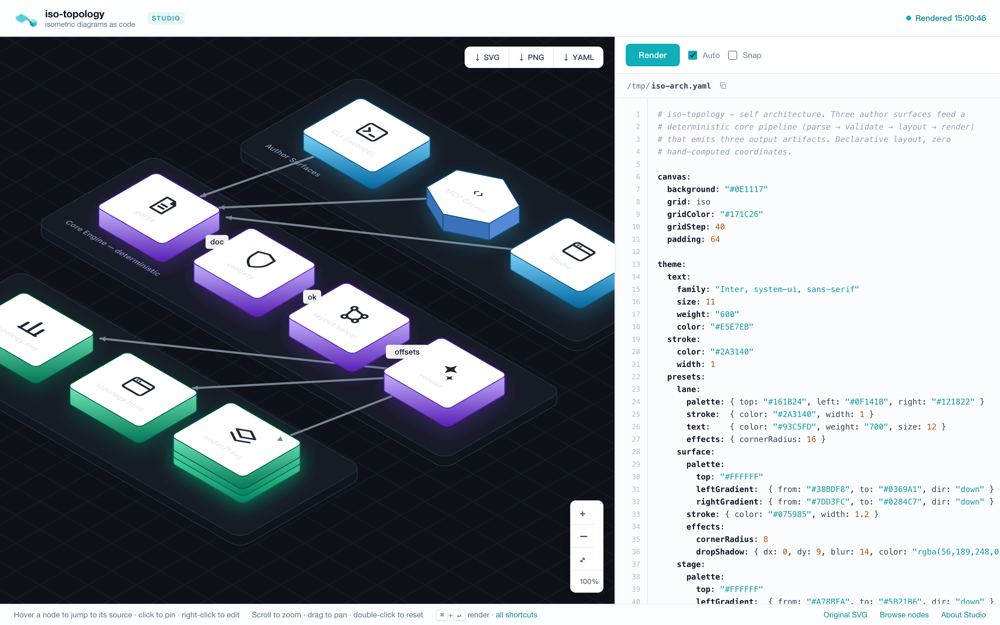

# isotopo Studio — the live diagram workbench

Studio is the interactive page you get from `isotopo serve` (and, in a
degraded static form, from every `isotopo render` output as
`topology.html`). One file, one canvas, sub-second feedback: the YAML
on the right, the rendered isometric scene on the left, and a live
bidirectional mapping between them — now with direct manipulation
(drag to move, right-click to edit) on top.

```bash
isotopo serve path/to/input.yaml     # → http://localhost:8731
ISOTOPO_PORT=9000 isotopo serve …    # pick a port
```



The canvas is on the left, the YAML editor on the right. Hover a node
to highlight its source; right-click to edit it; drag to move it.
Everything below is that surface in detail.

## Why it exists

iso-topology is agent-first: most diagrams here are *written by a
coding agent* against the DSL contract. But the loop only closes when
a human can look at the result, point at a node, and say "make this
one violet". Studio is that pointing device. It grew out of three
design positions:

1. **The original file is sacred.** Everything you edit in Studio is
   an in-browser copy. The file on disk is never written — not on
   re-render, not ever. Your edits persist as a local draft (per
   absolute path) across reloads, with a one-click `revert`. Taking
   changes home is explicit: `↓ YAML` (the edited source) or the
   canvas exports.
2. **Source and canvas are the same thing seen twice.** Hover a node
   or edge → its YAML block highlights and scrolls into view. Click it
   → the highlight pins (click again, or the empty canvas, to unpin).
   Put the caret inside a block → the node glows. Click a validation
   error → the offending line flashes. If you can see it, you can find
   it — in either direction.
3. **Local-first, zero cloud.** Studio is a single self-contained HTML
   page served by the same static binary that renders your diagrams.
   No accounts, no telemetry, no build step.

## Direct manipulation

Studio is not just a viewer — you can lay the diagram out and restyle
it by hand, drawio-style, and every gesture writes back to the YAML
(comment- and format-preserving) and re-renders.

### Move a node

Drag any node. The cursor reads `move` (4-way) on hover and `grabbing`
while dragging; connectors docked to that node **follow it live** so
the line never lags behind the gesture. On release the node lands
exactly under the cursor.

The **first** manual drag freezes the scene into explicit coordinates
and drops auto-layout — the drawio model. From then on the engine
never re-decides positions: every node sits where you put it, and you
own the layout. (Until that first drag, the diagram is whatever the
layout engine produced.)

### Move an edge — one segment at a time

Drag a connector and only the **segment you grabbed** moves, along its
perpendicular world axis; the segments on either side stretch to stay
connected and the two endpoints stay docked to their nodes. Routes stay
iso-axis-aligned (no stray diagonals). Drag different segments to shape
a route independently — they compose, they don't all slide together.

### Cursors & affordances

| Cursor / cue | Meaning |
|---|---|
| open hand (`grab`) | empty canvas — drag to pan |
| 4-way (`move`) + glow | over a movable node or edge |
| closed hand (`grabbing`) | a drag is in progress |

Toggle **Snap** in the toolbar to round dragged nodes to the grid (one
cell). Every structural edit — drag, detail edit, add/duplicate/delete —
is undoable with **⌘Z** / **⌘⇧Z** (when focus isn't in the editor).

## Right-click menu

Right-click an element for a context menu:

- **node** → Edit details · Duplicate (clone with a fresh id) · Delete
  (also removes its connectors and frees any sibling `place:`d against it)
- **edge** → Edit details · Delete
- **empty canvas** → ＋ Add node (a default rectangle) · Edit details
  (the canvas background/grid)

## Edit details

**Edit details** opens a modal of the element's visually-relevant
properties. Change them, hit **Update**, and both the canvas and the
YAML update for that element only.

The form is **schema-driven**: each editable DSL key is declared once
with an English label, a one-line description, an input type, and the
raw dotted key (shown in muted monospace beside the label, so the
friendly field stays anchored to the source). Highlights:

- **Grouped sections** — e.g. a node shows *Content* (label, shape,
  icon, preset), *Size* (width/depth/height as a compact row), and
  *Face colors* (top/left/right).
- **Illustrated choices** — enums render as tiles with a glyph, not bare
  words: node **shape** (cube / cylinder / sphere / cloud / person /
  prism / hexprism / …), canvas **grid** (iso / dots / hatch / solid),
  edge **arrowhead**, **routing** (orthogonal / straight / bezier), and
  edge **line style** (solid / dashed / dotted).
- **Colors** get a native picker plus a free-text field (any CSS color).
- **Icon** takes an `iso://…` ref, an image URL, or a local file via
  **Browse…** — the picked file is embedded as a data URI so it renders
  on the canvas and exports standalone. A local file *path* in the YAML
  is also inlined at render time.

Editing the canvas covers the whole image: **Fill color**, **Grid
pattern**, **Grid color**, **Grid step**, **Padding** (it creates the
`canvas:` block if your file doesn't have one yet).

## The rest of the surface

| Area | What it does |
|---|---|
| **Canvas** | Scroll to zoom, drag to pan, double-click resets, `⌘0` fits. The backdrop tints itself after `canvas.background`. Zoom controls bottom-right. |
| **Editor** | Syntax-highlighted YAML over a line-number gutter. Tab indents. Drag-resizable splitter (remembers its width). |
| **Render** | `Auto` re-renders (debounced) as you type; `⌘↵` forces it. A failed edit keeps the last good render with a "showing last good render" badge — the canvas never goes blank. |
| **Status** | One indicator, top-right: `Rendered HH:MM:SS` (green) stamps the last successful render so you can see how current the canvas is; `Render failed` (red) when the source has errors; `Offline` when the renderer is unreachable (re-checked every 5 s, so it re-enables itself when `isotopo serve` is back). |
| **Issues** | Validation problems under the editor with did-you-mean suggestions. Click one to jump to (and flash) the line. |
| **Export** | `↓ SVG` / `↓ PNG` (2×) / `↓ YAML` — capture exactly what the canvas shows (unsaved edits included). |
| **Browse nodes** | Per-part gallery — every node as a standalone SVG/YAML fragment, served live from the current file. |

Keyboard map lives behind `?` (or the "all shortcuts" footer link).

## Static degradation

`isotopo render out/` writes the same page as `out/topology.html`.
Opened as a file it keeps everything except live operations — the
status reads "Static file" and Render/move/edit are disabled until you
point `isotopo serve` at the source. Exports still work.

## Endpoints (for tooling)

| Route | Meaning |
|---|---|
| `GET /` | Studio, freshly rendered from the file on disk |
| `GET /topology.svg` | current render of the file on disk |
| `GET /nodes/_index.html`, `/nodes/<id>.svg\|.yaml\|.html` | per-part gallery |
| `POST /api/render?format=yaml` | render the posted source; returns `{"svg","issues"}` |
| `POST /api/move?kind=node\|edge&…` | text-edit a node offset / edge waypoints in the posted source; returns `{"yaml","svg","issues"}` |
| `POST /api/fields?kind=node\|edge\|canvas&…` | the detail-editor schema for an element, with current values |
| `POST /api/edit?kind=…&f=<json>` | apply detail-editor changes to the posted source; returns `{"yaml","svg","issues"}` |
| `POST /api/op?op=add\|delete\|duplicate&kind=node\|edge&…` | structural ops (add a node, delete a node+its connectors, duplicate a node); returns `{"yaml","svg","issues"}` |
| `GET /api/ping` | health |

All write endpoints do comment-preserving text surgery on the YAML you
POST — they never touch the file on disk.

## How it's built

The page is assembled at compile time from three embedded assets, so
the binary stays single-file while the front-end is ordinary, lintable
code:

```
studio/studio.html   page shell ({{CSS}}/{{JS}} + data placeholders)
studio/studio.css    all styles
studio/studio.js     all behaviour (zoom/pan, render, code mapping,
                     drag-to-edit, detail editor, context menu)
output.go            //go:embed + a two-pass replacer → the final page
```

## How it's tested

`tools/viewer-test/cdp_test.py` drives headless Chrome over CDP and
asserts the surface end-to-end. Run it whenever the `studio/` assets or
the serve handlers change:

```bash
python3 tools/viewer-test/cdp_test.py
```
